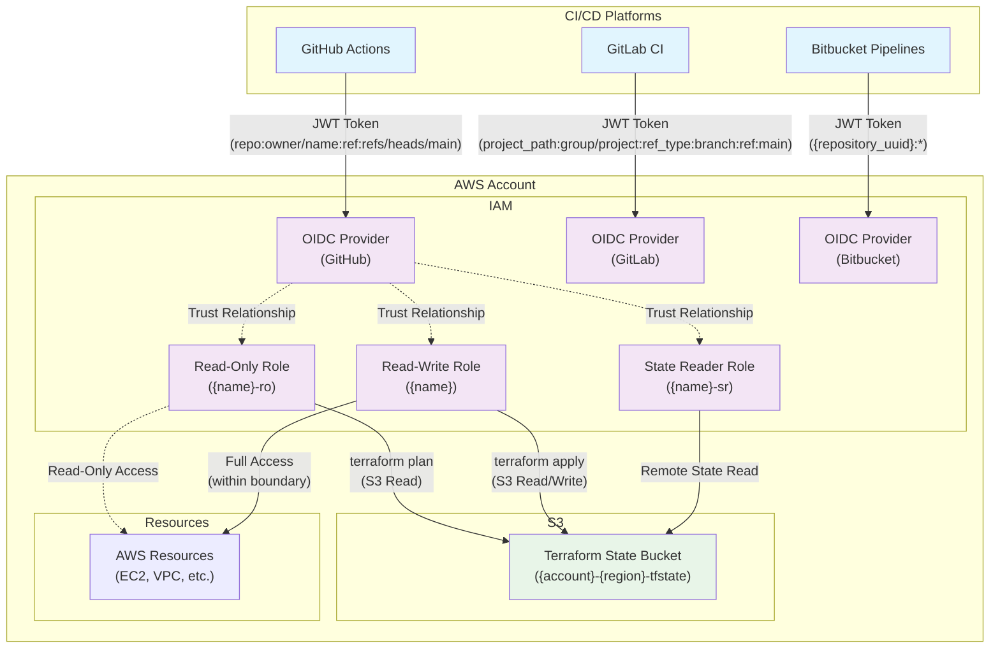
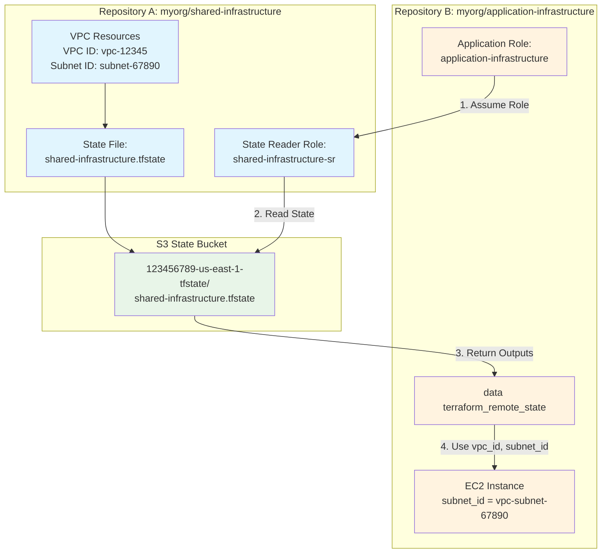
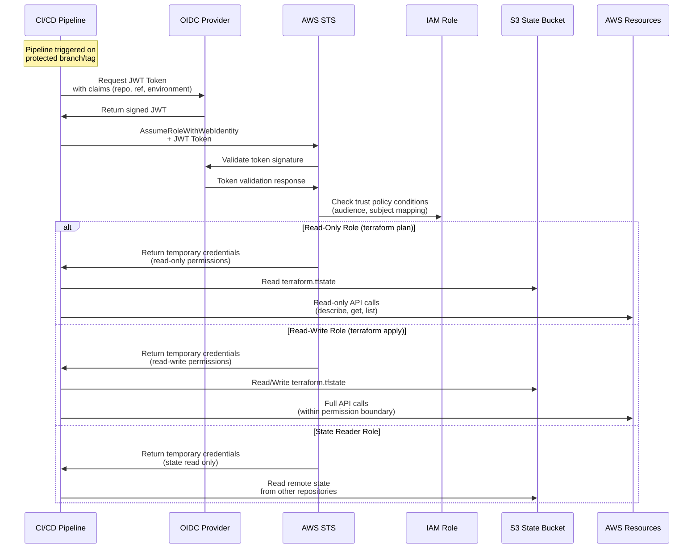
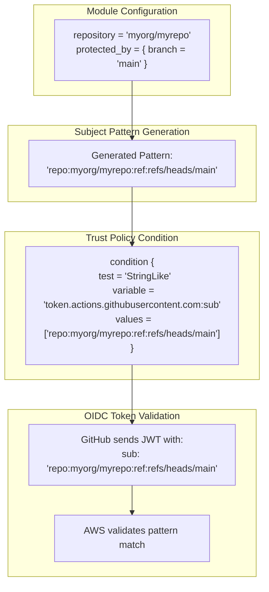
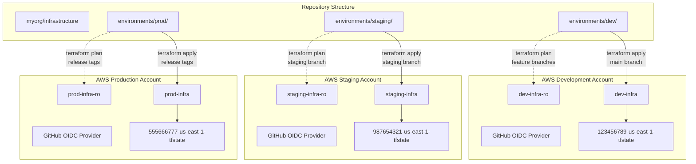
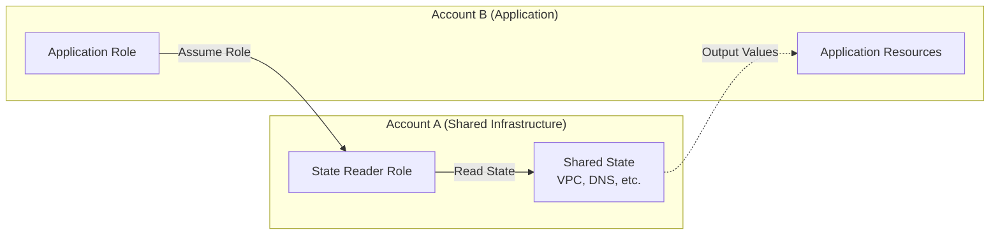

# Architecture Overview

This document provides an overview of the Terraform AWS OIDC Integration module architecture, including system design, data flows, and component interactions.

## High-Level Workflow

1. **Setup Phase**: Deploy OIDC providers and IAM roles (one-time setup)
2. **Development**: Developers push code to GitHub/GitLab repositories
3. **CI/CD Trigger**: Pipelines automatically start on pull requests or main branch
4. **Authentication**: Pipeline requests JWT token from GitHub/GitLab OIDC provider
5. **Role Assumption**: Pipeline uses JWT to assume appropriate AWS IAM role
6. **Infrastructure Deployment**: Pipeline runs `terraform plan/apply` with temporary AWS credentials
7. **State Storage**: Terraform state is stored in S3 bucket with proper access controls

## System Architecture

The module implements a secure CI/CD authentication pattern using OpenID Connect (OIDC) to eliminate the need for long-lived AWS credentials in continuous integration pipelines.



## Core Components

### 1. OIDC Identity Providers

**Purpose**: Establish trust relationships between AWS IAM and external CI/CD platforms.

**Supported Providers**:
- **GitHub Actions**: `https://token.actions.githubusercontent.com`
- **GitLab CI**: `https://gitlab.com` (or enterprise instances)
- **Bitbucket Pipelines**: `https://api.bitbucket.org/2.0/workspaces/{workspace}/pipelines-config/identity/oidc`

**Key Features**:
- Automatic SSL certificate thumbprint lookup
- Support for custom enterprise OIDC providers
- Per-provider tagging and configuration

### 2. IAM Roles with OIDC Trust

The module creates three distinct IAM roles for different operational contexts:

#### Quick Role Reference

| Role | Purpose | When Used | Trust Policy | Example Use |
|------|---------|-----------|-------------|-------------|
| **Read-Only** (`{name}-ro`) | `terraform plan` | Pull requests, validation | Any context in repo | PR validation |
| **Read-Write** (`{name}`) | `terraform apply` | Protected branches/tags | Restricted contexts | Main branch deploy |
| **State Reader** (`{name}-sr`) | Cross-repo state access | Reading other outputs | Specified repos only | Shared VPC access |

#### Detailed Role Descriptions

#### Read-Only Role (`{name}-ro`)
- **Purpose**: Used for `terraform plan` operations and pull request validation
- **Permissions**: Read-only access to AWS resources + Terraform state read access
- **Trust Policy**: Allows any context within the specified repository
- **Subject Pattern**: `repo:{repository}:*`

#### Read-Write Role (`{name}`)
- **Purpose**: Used for `terraform apply` operations on protected branches/tags
- **Permissions**: Full deployment permissions (within permission boundary)
- **Trust Policy**: Restricted to protected branches, environments, or tags
- **Subject Patterns**:
  - Branch: `repo:{repository}:ref:refs/heads/{branch}`
  - Environment: `repo:{repository}:environment:{environment}`
  - Tag: `repo:{repository}:ref:refs/tags/{tag}`

#### State Reader Role (`{name}-sr`)
- **Purpose**: Cross-repository remote state access
- **Permissions**: Read access to specific Terraform state files
- **Trust Policy**: Allows specified repositories to read remote state
- **Use Case**: Sharing infrastructure outputs between repositories

**Simple Example**: 
- **Repository A** deploys shared infrastructure (VPC, subnets, DNS zones)
- **Repository B** needs to deploy applications using that infrastructure
- **Solution**: Repository A creates a state reader role that trusts Repository B
- **Result**: Repository B can read Repository A's Terraform outputs (VPC ID, subnet IDs, etc.) without needing direct AWS permissions to those resources

**Detailed Cross-Repository Example:**

**Scenario**: You have two repositories that need to share infrastructure:
- **Repository A**: `myorg/shared-infrastructure` - Deploys VPC, subnets, DNS zones
- **Repository B**: `myorg/application-infrastructure` - Deploys applications that need to use the VPC from Repository A

```hcl
# Repository A: myorg/shared-infrastructure
# Creates VPC and outputs the IDs
resource "aws_vpc" "main" {
  cidr_block = "10.0.0.0/16"
  tags = { Name = "shared-vpc" }
}

resource "aws_subnet" "private" {
  vpc_id     = aws_vpc.main.id
  cidr_block = "10.0.1.0/24"
  tags = { Name = "private-subnet" }
}

# These outputs are stored in Repository A's state file
output "vpc_id" {
  value = aws_vpc.main.id
}

output "private_subnet_id" {
  value = aws_subnet.private.id
}
```

```hcl
# Repository B: myorg/application-infrastructure  
# Needs to read Repository A's state to get VPC ID
data "terraform_remote_state" "shared_infra" {
  backend = "s3"
  config = {
    bucket = "123456789-us-east-1-tfstate"
    key    = "shared-infrastructure.tfstate"  # Repository A's state file
    region = "us-east-1"
    
    # Use OIDC to assume the state reader role from Repository A
    assume_role_with_web_identity = {
      role_arn                = "arn:aws:iam::123456789:role/shared-infrastructure-sr"
      web_identity_token_file = "/tmp/web_identity_token_file"
    }
  }
}

# Now Repository B can use Repository A's outputs
resource "aws_instance" "app_server" {
  ami           = "ami-12345678"
  instance_type = "t3.micro"
  subnet_id     = data.terraform_remote_state.shared_infra.outputs.private_subnet_id
  
  tags = { Name = "app-server" }
}
```

**The Problem Without State Reader Role:**
- Repository B's normal roles (`application-infrastructure-ro`, `application-infrastructure`) can only access their own state file
- They cannot read `shared-infrastructure.tfstate` from Repository A
- The `terraform_remote_state` data source would fail with "Access Denied"
- Without this access, Repository B cannot discover the VPC ID or subnet IDs created by Repository A

**The Solution With State Reader Role:**
- Repository A creates a state reader role: `shared-infrastructure-sr`
- This role is configured to trust Repository B: `shared_repositories = ["myorg/application-infrastructure"]`
- Repository B can assume this role to read Repository A's state file
- Repository B gets the VPC ID and subnet ID from Repository A's outputs

**Visual Flow:**


**Module Configuration Example:**

```hcl
# Repository A: myorg/shared-infrastructure
# Creates roles including state reader role
module "shared_infra_roles" {
  source = "appvia/oidc/aws//modules/role"
  
  name        = "shared-infrastructure"
  repository  = "myorg/shared-infrastructure"
  description = "Shared infrastructure deployment roles"
  
  # Standard role configuration
  common_provider = "github"
  permission_boundary_arn = "arn:aws:iam::aws:policy/PowerUserAccess"
  
  # CRITICAL: Allow other repositories to read our state
  shared_repositories = [
    "myorg/application-infrastructure",
    "myorg/frontend-infrastructure",
    "myorg/monitoring-infrastructure"
  ]
  
  tags = {
    Purpose = "shared-infrastructure"
  }
}

# This creates 3 roles:
# - shared-infrastructure-ro (read-only)
# - shared-infrastructure (read-write) 
# - shared-infrastructure-sr (state reader) <- This is the key role!
```

```hcl
# Repository B: myorg/application-infrastructure
# Uses the remote_state module to read Repository A's state
module "read_shared_state" {
  source = "appvia/oidc/aws//modules/remote_state"
  
  account_id              = "123456789012"
  region                  = "us-east-1"
  repository              = "myorg/shared-infrastructure"  # Repository A's name
  web_identity_token_file = "/tmp/web_identity_token_file"
}

# Now you can access Repository A's outputs
output "shared_vpc_id" {
  value = module.read_shared_state.outputs.vpc_id
}
```

### 3. Terraform State Management

**S3 Bucket Naming Convention**: `{account_id}-{region}-tfstate`

**State File Naming**: `{repository_name}.tfstate` or `{repository_name}-{suffix}.tfstate`

**Access Patterns**:
- Read-only role: Read state file + create lock file
- Read-write role: Full state file management + lock file management
- State reader role: Read-only access to specific state files

## OIDC Authentication Flow



## Module Structure

The repository contains three child modules with clear dependencies:

### Deployment Order (Critical)

**Must deploy in this exact order:**

1. **modules/provider** → 2. **modules/role** → 3. **modules/remote_state**

**Why this order matters:**
- **Provider first**: Creates the OIDC identity providers that roles will reference
- **Role second**: Creates IAM roles that trust the OIDC providers (requires providers to exist)
- **Remote state last**: Used in CI/CD pipelines to read state (requires roles to exist)

### Module Details

### modules/provider
- **Purpose**: Creates AWS IAM OIDC Identity Providers
- **Resources Created**: 
  - `aws_iam_openid_connect_provider` for GitHub/GitLab/Bitbucket
  - TLS certificate thumbprint validation
- **Prerequisites**: 
  - Network access to OIDC endpoints (https://token.actions.githubusercontent.com, etc.)
  - IAM permissions to create OIDC providers
- **Deploy First**: Roles cannot be created without these providers existing

### modules/role  
- **Purpose**: Creates IAM roles with OIDC trust relationships
- **Resources Created**: 
  - 3 IAM roles: `{name}-ro` (read-only), `{name}` (read-write), `{name}-sr` (state reader)
  - Inline policies for state bucket access
  - Policy attachments for AWS service permissions
- **Prerequisites**: 
  - OIDC provider must exist (created by provider module)
  - S3 state bucket must exist (created manually before deploying any modules)
  - Permission boundary policy must exist (if using custom boundaries)
- **Deploy Second**: References OIDC providers created in step 1

### modules/remote_state
- **Purpose**: Enables cross-repository state sharing using OIDC authentication
- **Resources Created**: None (data sources only)
- **How it works**:
  - Configures Terraform backend to assume a state reader role
  - Uses web identity token from CI/CD pipeline
  - Reads state files from other repositories' S3 keys
- **Prerequisites**: 
  - State reader role must exist in target repository (created by role module)
  - Web identity token file available (provided by CI/CD platform)
  - Target state file must exist in S3 bucket
- **Usage**: Called within CI/CD pipelines during Terraform runs, not during initial module setup

## Subject Mapping Implementation

**Summary**: The module automatically creates IAM trust policies that only allow specific GitHub/GitLab contexts (like `main` branch or `production` environment) to assume roles. This prevents unauthorized access from other branches or repositories.

**How it works**: When you configure `repository = "myorg/myrepo"` and `protected_by = { branch = "main" }`, the module generates a trust policy condition that only allows JWT tokens with the subject `repo:myorg/myrepo:ref:refs/heads/main` to assume the role.

### Technical Details

The module implements access control through **subject claim mapping** within IAM trust policy conditions. When you configure the module with repository and protection settings, it dynamically generates specific subject patterns that are embedded directly into the trust policy conditions.

### How Subject Mapping Works



### Complete Trust Policy Examples

#### GitHub Actions Trust Policy (Read-Write Role)
```hcl
# Generated by module when configured with:
# repository = "myorg/infrastructure"
# protected_by = { branch = "main" }

data "aws_iam_policy_document" "github_trust" {
  statement {
    actions = ["sts:AssumeRoleWithWebIdentity"]
    
    principals {
      type        = "Federated"
      identifiers = [data.aws_iam_openid_connect_provider.github.arn]
    }
    
    # Audience validation - ensures token is for AWS STS
    condition {
      test     = "StringEquals"
      variable = "token.actions.githubusercontent.com:aud"
      values   = ["sts.amazonaws.com"]
    }
    
    # Subject mapping - controls WHO can assume the role
    condition {
      test     = "StringLike"
      variable = "token.actions.githubusercontent.com:sub"
      values   = [
        "repo:myorg/infrastructure:ref:refs/heads/main"  # Only main branch
      ]
    }
  }
}
```

#### GitLab CI Trust Policy (Environment Protected)
```hcl
# Generated by module when configured with:
# repository = "myorg/infrastructure"
# protected_by = { environment = "production" }

data "aws_iam_policy_document" "gitlab_trust" {
  statement {
    actions = ["sts:AssumeRoleWithWebIdentity"]
    
    principals {
      type        = "Federated"
      identifiers = [data.aws_iam_openid_connect_provider.gitlab.arn]
    }
    
    # Audience validation
    condition {
      test     = "StringEquals"
      variable = "gitlab.com:aud"
      values   = ["https://gitlab.com"]
    }
    
    # Subject mapping - environment-based access
    condition {
      test     = "StringLike"
      variable = "gitlab.com:sub"
      values   = [
        "project_path:myorg/infrastructure:environment:production"
      ]
    }
  }
}
```

### Subject Pattern Templates by Provider

The module uses these templates to generate subject patterns:

#### GitHub Actions Templates
```hcl
# Template definitions in modules/role/locals.tf
github = {
  # Read-only role: any context in repository
  subject_reader_mapping = "repo:{repo}:*"
  
  # Branch-specific access
  subject_branch_mapping = "repo:{repo}:ref:refs/heads/{ref}"
  
  # Environment-specific access  
  subject_env_mapping = "repo:{repo}:environment:{env}"
  
  # Tag-specific access
  subject_tag_mapping = "repo:{repo}:ref:refs/tags/{ref}"
}
```

**Example Pattern Generation:**
- Input: `repository = "myorg/myrepo"`, `protected_by.branch = "main"`
- Generated: `"repo:myorg/myrepo:ref:refs/heads/main"`

#### GitLab CI Templates
```hcl
gitlab = {
  # Read-only role: any pipeline in project
  subject_reader_mapping = "project_path:{repo}:*"
  
  # Branch/tag-specific access
  subject_branch_mapping = "project_path:{repo}:ref_type:{type}:ref:{ref}"
  subject_tag_mapping = "project_path:{repo}:ref_type:{type}:ref:{ref}"
}
```

**Example Pattern Generation:**
- Input: `repository = "mygroup/myproject"`, `protected_by.branch = "production"`
- Generated: `"project_path:mygroup/myproject:ref_type:branch:ref:production"`

#### Bitbucket Templates
```hcl
bitbucket = {
  # UUID-based patterns (different from GitHub/GitLab)
  subject_reader_mapping = "{repository_uuid}:*"
  subject_branch_mapping = "{repository_uuid}:*"
}
```

**Example Pattern Generation:**
- Input: `repository_uuid = "12345678-1234-1234-1234-123456789012"`
- Generated: `"12345678-1234-1234-1234-123456789012:*"`

### Dynamic Pattern Substitution

The module performs runtime template substitution:

```hcl
# From modules/role/main.tf - how patterns are generated
locals {
  template_keys_regex = "{(repo|type|ref|env)}"
}

# Example: Generate branch protection pattern
values = [
  format(
    replace(
      local.selected_provider.subject_branch_mapping, 
      format("/%s/", local.template_keys_regex), 
      "%s"
    ), 
    [
      for v in flatten(regexall(local.template_keys_regex, local.selected_provider.subject_branch_mapping)) : {
        repo = var.repository      # "myorg/myrepo"
        type = "branch"           # "branch"
        ref  = var.protected_by.branch  # "main"
      }[v]
    ]...
  )
]

# Results in: "repo:myorg/myrepo:ref:refs/heads/main"
```

### Multi-Condition Trust Policies

For enhanced security, roles can have multiple subject patterns:

```hcl
# Read-write role with multiple access methods
condition {
  test     = "StringLike"
  variable = "token.actions.githubusercontent.com:sub"
  values   = compact([
    # Allow main branch
    var.protected_by.branch != null ? 
      "repo:myorg/myrepo:ref:refs/heads/main" : "",
    
    # Allow production environment
    var.protected_by.environment != null ? 
      "repo:myorg/myrepo:environment:production" : "",
    
    # Allow version tags
    var.protected_by.tag != null ? 
      "repo:myorg/myrepo:ref:refs/tags/v*" : ""
  ])
}
```

This implementation ensures that **subject claim mapping IS the trust policy condition** - they are the same mechanism, with the module automating the generation of appropriate subject patterns based on your configuration.

## Multi-Environment Architecture Pattern



## Security Architecture

### Permission Boundary Pattern
```hcl
# The permission boundary acts as a maximum permission filter
# Even if a role has AdministratorAccess attached,
# the boundary limits what actions can actually be performed

resource "aws_iam_role" "deployment" {
  permissions_boundary = var.permission_boundary_arn
  
  # Role can have broad policies attached, but boundary limits actual access
}
```

### Cross-Account State Sharing


## Key Concepts Summary

**Essential points to understand before proceeding:**

### What This Module Does
- **Replaces long-lived AWS access keys** with short-lived tokens from GitHub/GitLab
- **Creates three types of IAM roles** for different pipeline needs (plan, apply, cross-repo access)
- **Automatically configures security** so only authorized branches/environments can deploy

### What You Need to Provide
- **S3 bucket for Terraform state** (created manually before deploying this module)
- **Repository names and protection rules** (which branches can deploy)
- **Permission boundaries** (maximum permissions the roles can have)

### Common Confusion Points Clarified

1. **S3 Bucket Purpose**: 
   - The S3 bucket (`{account}-{region}-tfstate`) stores Terraform state for your applications
   - It does NOT store the terraform-aws-oidc module's own state
   - You must create this bucket BEFORE deploying the OIDC module

2. **Bootstrap Order**:
   - **Step 1**: Manually create S3 bucket (one-time setup)
   - **Step 2**: Deploy terraform-aws-oidc module (creates roles)
   - **Step 3**: Configure CI/CD pipelines to use the roles
   - **Step 4**: Deploy your applications using OIDC authentication

3. **Three Roles Explained**:
   - **Read-Only (`{name}-ro`)**: For `terraform plan` in pull requests (safe validation)
   - **Read-Write (`{name}`)**: For `terraform apply` on protected branches (actual deployment)
   - **State Reader (`{name}-sr`)**: For reading other repositories' outputs (cross-team collaboration)

## Next Steps

- **[Hidden Dependencies](./02-hidden-dependencies.md)** - Learn about critical prerequisites
- **[Setup Guide](./03-setup-guide.md)** - Implement step-by-step
- **[Security Best Practices](./05-security-best-practices.md)** - Secure your deployment