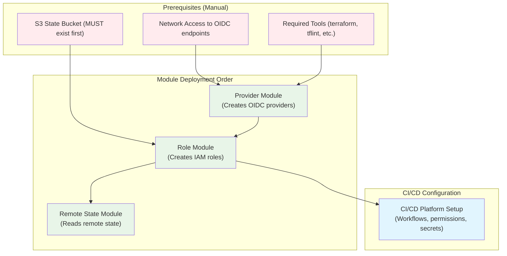

# Hidden Dependencies and Prerequisites

This document reveals all the hidden dependencies, assumptions, and prerequisites that are not clearly documented in the main README but are critical for successful deployment.

## AWS Account Prerequisites

### 1. Required AWS Permissions for Deployment

To deploy this module, your AWS role assumed by the terraform deployment process must have these permissions:

**Permission Groups Explained**:
- **OIDC Provider Management**: Creates/manages the GitHub/GitLab identity providers
- **Role Management**: Creates the three IAM roles (read-only, read-write, state-reader) 
- **Identity Access**: Gets current account ID and region for resource naming

```json
{
  "Version": "2012-10-17",
  "Statement": [
    {
      "Sid": "OIDCProviderManagement",
      "Effect": "Allow",
      "Action": [
        "iam:CreateOpenIDConnectProvider",
        "iam:GetOpenIDConnectProvider",
        "iam:TagOpenIDConnectProvider",
        "iam:ListOpenIDConnectProviders",
        "iam:DeleteOpenIDConnectProvider"
      ],
      "Resource": "*"
    },
    {
      "Sid": "RoleManagement", 
      "Effect": "Allow",
      "Action": [
        "iam:CreateRole",
        "iam:GetRole",
        "iam:TagRole",
        "iam:PutRolePolicy",
        "iam:AttachRolePolicy",
        "iam:DetachRolePolicy",
        "iam:DeleteRolePolicy",
        "iam:ListAttachedRolePolicies",
        "iam:ListRolePolicies",
        "iam:GetRolePolicy",
        "iam:DeleteRole"
      ],
      "Resource": "*"
    },
    {
      "Sid": "IdentityAndRegionAccess",
      "Effect": "Allow",
      "Action": [
        "sts:GetCallerIdentity",
        "ec2:DescribeRegions"
      ],
      "Resource": "*"
    }
  ]
}
```

### 2. Account Structure and Deployment Context

**Deployment Account Flexibility**: 
✅ **Can deploy from any AWS account** - No need for organization root account access
✅ **Resources created in same account** - Module creates resources where it's deployed
✅ **Multi-account support** - Deploy separate instances in each account as needed

**Key Assumptions**:
- **Account ID**: Retrieved automatically via `data.aws_caller_identity.current`
- **Region**: Retrieved automatically via `data.aws_region.current`
- **Isolation**: Each AWS account needs its own OIDC provider instances
- **Cross-account**: Requires explicit trust relationships (covered in remote state module)

**Deployment Scenarios**:

1. **Single Account Setup** (Most Common)
   - Deploy OIDC module in your main AWS account
   - Application teams use roles in same account
   - S3 state bucket: `{account_id}-{region}-tfstate`

2. **Multi-Account Setup** (Enterprise)
   - Deploy OIDC module in each AWS account separately
   - Each account has its own S3 state bucket
   - Cross-account state sharing via state-reader roles

3. **Shared Services Account**
   - Deploy OIDC module in shared services account
   - Applications in other accounts use cross-account roles
   - Requires additional IAM trust relationships

**Important**: The AWS identity (user/role) deploying the module needs the IAM permissions listed above, but this can be any properly configured identity in the target AWS account - it doesn't require organization-level or root account privileges.

## S3 State Infrastructure (CRITICAL DEPENDENCY)

### Hidden Assumption: Pre-existing S3 Bucket

The module **assumes** an S3 bucket exists but **never creates it**. This is a major hidden dependency that creates a bootstrap problem.

**IMPORTANT CLARIFICATION**: 
- The S3 bucket dependency is for storing Terraform state files of applications you'll deploy AFTER setting up OIDC
- The terraform-aws-oidc module itself can be deployed using any backend configuration (local state, different S3 bucket, Terraform Cloud, etc.)

### Understanding the Two-Phase Bootstrap Process

**Phase 1: Infrastructure Team (One-time Setup)**
1. Manually create S3 bucket: `{account_id}-{region}-tfstate`
2. Deploy terraform-aws-oidc module using existing AWS credentials
3. Module creates IAM roles with permissions to read/write the S3 bucket
4. Configure monitoring and security policies

**Phase 2: Application Teams (Ongoing Usage)**  
1. Configure CI/CD workflows to use the OIDC roles created in Phase 1
2. Deploy applications (EC2, RDS, etc.) using the OIDC roles
3. Application Terraform state files get stored in the S3 bucket
4. Teams can read each other's state using the state-reader roles

**Key Point**: The terraform-aws-oidc module's own state is stored wherever YOU configure it during deployment - it's completely separate from the S3 bucket the module expects to exist.

> ⚠️ **IMPORTANT NOTE**: The imperative AWS CLI commands shown below for creating the S3 bucket are intended for exploratory testing of this module in isolation, typically against a personal AWS sandbox or temporary test account. In a managed AWS estate, critical infrastructure like Terraform state S3 buckets should be provisioned and managed by a separate, dedicated Terraform stack, adhering to your organization's infrastructure-as-code best practices.

**Example Creation Commands**:

```bash
# Get account context
export AWS_ACCOUNT_ID=$(aws sts get-caller-identity --query Account --output text)
export AWS_DEFAULT_REGION=$(aws configure get region)

# Create the state bucket (REQUIRED before module deployment)
aws s3 mb s3://${AWS_ACCOUNT_ID}-${AWS_DEFAULT_REGION}-tfstate

# Enable versioning (recommended for state history)
aws s3api put-bucket-versioning \
  --bucket ${AWS_ACCOUNT_ID}-${AWS_DEFAULT_REGION}-tfstate \
  --versioning-configuration Status=Enabled

# Enable server-side encryption (security best practice)
aws s3api put-bucket-encryption \
  --bucket ${AWS_ACCOUNT_ID}-${AWS_DEFAULT_REGION}-tfstate \
  --server-side-encryption-configuration '{
    "Rules": [
      {
        "ApplyServerSideEncryptionByDefault": {
          "SSEAlgorithm": "AES256"
        }
      }
    ]
  }'

# Block public access (critical security requirement)
aws s3api put-public-access-block \
  --bucket ${AWS_ACCOUNT_ID}-${AWS_DEFAULT_REGION}-tfstate \
  --public-access-block-configuration \
    BlockPublicAcls=true,IgnorePublicAcls=true,BlockPublicPolicy=true,RestrictPublicBuckets=true
```

### State File Naming Logic (Hidden)

```bash
# Repository "myorg/my-infrastructure" becomes state key "my-infrastructure.tfstate"
# The module extracts only the LAST part of the repository path

# With suffix: "my-infrastructure-prod.tfstate"
```

**Verification Commands**:
```bash
# Verify bucket exists
aws s3 ls s3://${AWS_ACCOUNT_ID}-${AWS_DEFAULT_REGION}-tfstate

# Check bucket policy and access
aws s3api get-bucket-policy --bucket ${AWS_ACCOUNT_ID}-${AWS_DEFAULT_REGION}-tfstate

# List state files
aws s3 ls s3://${AWS_ACCOUNT_ID}-${AWS_DEFAULT_REGION}-tfstate/ --recursive
```

## Network and Connectivity Requirements

### OIDC Provider Endpoint Access

**Critical Network Dependencies** (often blocked by corporate firewalls):

```bash
# These URLs MUST be accessible from Terraform execution environment
curl -I https://token.actions.githubusercontent.com/.well-known/openid_configuration
curl -I https://gitlab.com/.well-known/openid_configuration
curl -I https://api.bitbucket.org/2.0/workspaces/WORKSPACE/pipelines-config/identity/oidc

# Enterprise instances (if applicable)
curl -I https://github.company.com/.well-known/openid_configuration
curl -I https://gitlab.company.com/.well-known/openid_configuration
```

### SSL Certificate Validation

**Hidden Dependency**: The module automatically retrieves SSL certificate thumbprints to validate OIDC provider identity. This thumbprint acts as a security fingerprint to ensure you're connecting to the legitimate provider.

**What Certificate Thumbprints Are Used For**:
- AWS requires the root certificate thumbprint of OIDC providers
- Prevents man-in-the-middle attacks during token validation
- Must be updated if the provider changes their certificate authority

**Manual Thumbprint Retrieval** (if auto-lookup fails):
```bash
# Test connectivity first
if curl -s --connect-timeout 5 https://token.actions.githubusercontent.com/.well-known/openid_configuration > /dev/null; then
    echo "✅ GitHub OIDC endpoint accessible"
else
    echo "❌ Cannot reach GitHub OIDC endpoint - check firewall/proxy"
    exit 1
fi

# Get thumbprint with error handling
THUMBPRINT=$(echo | openssl s_client -servername token.actions.githubusercontent.com \
  -connect token.actions.githubusercontent.com:443 2>/dev/null | \
  openssl x509 -fingerprint -noout -sha1 2>/dev/null | \
  cut -d'=' -f2 | tr -d ':')

if [ -n "$THUMBPRINT" ]; then
    echo "✅ Thumbprint retrieved: $THUMBPRINT"
else
    echo "❌ Failed to retrieve thumbprint - check network connectivity"
    # Fallback: Use GitHub's current thumbprint (as of 2024)
    echo "Using known GitHub thumbprint: 1c58a3a8518e8759bf075b76b750d4f2df264fcd"
fi

# Verify full certificate chain (troubleshooting)
openssl s_client -connect token.actions.githubusercontent.com:443 \
  -servername token.actions.githubusercontent.com -showcerts
```

**Common Issues**:
- **Corporate firewalls**: May block direct SSL connections
- **Proxy servers**: May modify certificate chains
- **DNS issues**: May prevent reaching OIDC endpoints
- **Certificate rotation**: Provider may update certificates

**Troubleshooting Steps**:
```bash
# Test basic connectivity
ping token.actions.githubusercontent.com

# Test HTTPS access
curl -v https://token.actions.githubusercontent.com/.well-known/openid_configuration

# Check if proxy is interfering
export https_proxy="" && curl -v https://token.actions.githubusercontent.com/.well-known/openid_configuration
```

## Tool Dependencies (From Makefile)

### Required Tools Not Listed in README

The Makefile requires these tools to be installed and in PATH:

```bash
# Check if tools are installed
terraform --version          # Required: >= 1.0.0
terraform-docs --version     # Required for documentation generation
tflint --version            # Required for linting  
trivy --version             # Required for security scanning
commitlint --version        # Required for commit validation (Node.js dependency)
git --version               # Required for commit history validation
```

**Installation Commands**:
```bash
# macOS with Homebrew
brew install terraform terraform-docs tflint trivy
npm install -g @commitlint/cli @commitlint/config-conventional
```

## CI/CD Platform Prerequisites

### GitHub Actions Configuration

**Repository Settings Requirements**:
- Actions must be enabled
- Workflow permissions: Read and write OR specific permissions configured
- Environment protection rules (if using environment-based deployments)

**Required Workflow Configuration**:
```yaml
# .github/workflows/terraform.yml
permissions:
  id-token: write    # CRITICAL: Often forgotten, causes "token request failed"
  contents: read     # Required for repository access

# Environment variables that must be configured
secrets:
  AWS_ROLE_ARN: arn:aws:iam::ACCOUNT:role/ROLE-NAME
  AWS_ACCOUNT_ID: "123456789012"  # Must be string format, not number
```

**Token Request Debugging**:
```bash
# In GitHub Actions workflow, debug token request
echo "ACTIONS_ID_TOKEN_REQUEST_TOKEN is set: $([ -n "$ACTIONS_ID_TOKEN_REQUEST_TOKEN" ] && echo "YES" || echo "NO")"
echo "ACTIONS_ID_TOKEN_REQUEST_URL is set: $([ -n "$ACTIONS_ID_TOKEN_REQUEST_URL" ] && echo "YES" || echo "NO")"
```

**Common GitHub Actions Issues**:
- **"Token request failed"**: Missing `id-token: write` permission
- **"Access denied"**: Role ARN incorrect or repository name mismatch
- **"Invalid audience"**: Check OIDC provider configuration
- **Workflow not triggered**: Check branch protection rules and triggers

**Troubleshooting Steps**:
```yaml
# Add to workflow for debugging
- name: Debug OIDC Context
  run: |
    echo "Repository: ${{ github.repository }}"
    echo "Ref: ${{ github.ref }}"
    echo "Actor: ${{ github.actor }}"
    echo "Environment: ${{ github.environment }}"
    echo "Token URL: ${{ env.ACTIONS_ID_TOKEN_REQUEST_URL }}"
```

### GitLab CI Configuration

**Project Settings Requirements**:
- CI/CD pipelines must be enabled
- OIDC must be enabled in project settings
- Variables must be configured at project or group level

**Required Pipeline Configuration**:
```yaml
# .gitlab-ci.yml
id_tokens:
  GITLAB_OIDC_TOKEN:
    aud: https://gitlab.com    # Must match OIDC provider audience

variables:
  AWS_ROLE_ARN: arn:aws:iam::ACCOUNT:role/ROLE-NAME
  AWS_DEFAULT_REGION: us-east-1
```

### Bitbucket Pipelines Configuration

**Repository Settings Requirements**:
- Pipelines must be enabled in repository settings
- OIDC must be configured with workspace UUID
- Repository UUID must be obtained from pipeline settings

**Required Configuration Variables**:
```yaml
# Repository or workspace variables
AWS_ROLE_ARN: arn:aws:iam::ACCOUNT:role/ROLE-NAME
BITBUCKET_WORKSPACE_UUID: "12345678-1234-1234-1234-123456789012"
BITBUCKET_REPO_UUID: "{87654321-4321-4321-4321-210987654321}"
```

**UUID Discovery**:
```bash
# Get workspace UUID from Bitbucket settings
# Repository Settings > OpenID Connect > Workspace UUID

# Get repository UUID from API (if available)
curl -X GET \
  "https://api.bitbucket.org/2.0/repositories/WORKSPACE/REPOSITORY" \
  -H "Authorization: Bearer ACCESS_TOKEN"
```

## Module Dependency Chain

### Critical Deployment Order



### OIDC Provider Dependency

**Hidden Requirement**: The role module expects OIDC providers to already exist:

```hcl
# modules/role/data.tf
data "aws_iam_openid_connect_provider" "this" {
  url = local.selected_provider.url  # MUST exist or plan fails
}
```

**Verification Commands**:
```bash
# Check if required OIDC provider exists
aws iam list-open-id-connect-providers

# Get specific provider details
aws iam get-open-id-connect-provider \
  --open-id-connect-provider-arn arn:aws:iam::ACCOUNT:oidc-provider/token.actions.githubusercontent.com
```

## Permission Boundary Requirements

### Hidden Security Assumption

**Critical Security Flaw in Examples**: The provided examples use `AdministratorAccess` as a permission boundary, which provides NO security protection:

```hcl
# DANGEROUS - This is security theater, the boundary allows everything!
permission_boundary_arn = "arn:aws:iam::aws:policy/AdministratorAccess"

# CORRECT - This actually limits permissions
permission_boundary_arn = "arn:aws:iam::aws:policy/PowerUserAccess"
```

**Create Custom Permission Boundary**:
```bash
# Example: Create a restrictive deployment boundary
cat > deployment-boundary.json << 'EOF'
{
  "Version": "2012-10-17",
  "Statement": [
    {
      "Effect": "Allow",
      "Action": [
        "ec2:*",
        "s3:*",
        "rds:*",
        "elasticloadbalancing:*",
        "autoscaling:*"
      ],
      "Resource": "*"
    },
    {
      "Effect": "Deny",
      "Action": [
        "iam:*",
        "organizations:*",
        "account:*"
      ],
      "Resource": "*"
    }
  ]
}
EOF

# Create the policy
aws iam create-policy \
  --policy-name TerraformDeploymentBoundary \
  --policy-document file://deployment-boundary.json
```

## Cross-Account Dependencies

### Remote State Reader Prerequisites

**For Cross-Account State Reading**:
1. Target account must have the state reader role created
2. Source account must have web identity token file available
3. State bucket must exist in target account
4. Network connectivity between accounts must allow S3 access

**Verification Commands**:
```bash
# Check if state reader role exists in target account
aws iam get-role --role-name REPOSITORY-sr \
  --profile target-account-profile

# Test cross-account state access
aws s3 ls s3://TARGET-ACCOUNT-REGION-tfstate/ \
  --profile target-account-profile
```

## Environment-Specific Hidden Requirements

### Development Environment
- Any branch can assume read-only role
- Permissive policies for testing
- Lower security requirements

### Production Environment  
- Only specific branches/tags can assume roles
- Restrictive policies and permission boundaries
- Additional approval requirements
- Monitoring and alerting configured

## Prerequisites Impact Matrix

Understanding the consequences of missing prerequisites helps prioritize setup tasks:

| Prerequisite | Required For | Impact if Missing | Severity |
|-------------|-------------|-------------------|----------|
| **S3 State Bucket** | Application deployments via OIDC | ❌ CI/CD pipelines cannot store state | CRITICAL |
| **AWS IAM Permissions** | Module deployment | ❌ Cannot create OIDC providers/roles | CRITICAL |
| **OIDC Endpoint Access** | Provider creation | ❌ Certificate thumbprint lookup fails | HIGH |
| **terraform >= 1.0.0** | All operations | ❌ Module syntax not supported | HIGH |
| **terraform-docs** | Documentation generation | ❗ `make documentation` fails | LOW |
| **tflint** | Code quality checks | ❗ `make lint` fails | MEDIUM |
| **trivy** | Security scanning | ❗ `make security` fails | MEDIUM |
| **commitlint** | Commit message validation | ❗ `make validate-commits` fails | LOW |
| **Git origin/main** | Makefile targets | ❗ Some make targets fail | LOW |
| **GitHub Actions permissions** | GitHub CI/CD | ❌ "Token request failed" errors | HIGH |
| **GitLab OIDC enabled** | GitLab CI/CD | ❌ Cannot generate OIDC tokens | HIGH |
| **Bitbucket UUID config** | Bitbucket Pipelines | ❌ Repository UUID mismatch | HIGH |
| **Network/Firewall access** | OIDC provider setup | ❌ Cannot retrieve certificates | MEDIUM |

**Severity Levels**:
- **CRITICAL**: Deployment completely blocked
- **HIGH**: Major functionality broken  
- **MEDIUM**: Some features unavailable
- **LOW**: Development workflow impacted only

## Complete Prerequisites Checklist

Before deploying this module, ensure ALL of the following are in place:

### AWS Prerequisites
- [ ] AWS account with appropriate IAM permissions
- [ ] S3 state bucket created: `{account_id}-{region}-tfstate`
- [ ] S3 bucket has versioning enabled (recommended)
- [ ] S3 bucket has encryption enabled (security requirement)
- [ ] S3 bucket has public access blocked (security requirement)

### Network Prerequisites
- [ ] Network access to OIDC provider endpoints verified
- [ ] Corporate firewall allows HTTPS to required domains
- [ ] SSL certificate validation works from deployment environment
- [ ] DNS resolution works for OIDC provider domains

### Tool Prerequisites
- [ ] terraform >= 1.0.0 installed
- [ ] terraform-docs installed (for documentation)
- [ ] tflint installed (for linting)
- [ ] trivy installed (for security scanning) 
- [ ] commitlint installed (for commit validation)
- [ ] git configured with origin/main branch

### CI/CD Prerequisites
- [ ] Repository has required permissions configured
- [ ] OIDC is enabled in CI/CD platform
- [ ] Required environment variables/secrets are set
- [ ] Workflow files have correct permissions block
- [ ] Branch protection rules are configured (if using)

## Next Steps

- **[Setup Guide](./03-setup-guide.md)** - Follow step-by-step implementation
- **[Examples Analysis](./04-examples-analysis.md)** - Understand provided examples
- **[Security Best Practices](./05-security-best-practices.md)** - Secure your deployment

