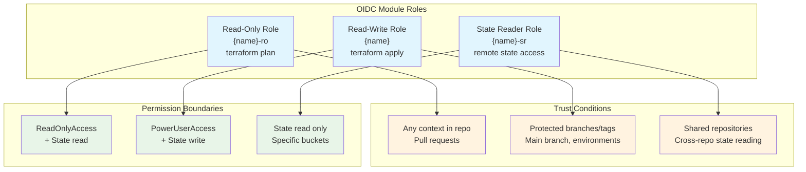

# Security Best Practices

This document provides comprehensive security guidance for implementing the Terraform AWS OIDC Integration module in production environments.

## 🛡️ Security Philosophy

The OIDC integration module enables powerful CI/CD automation but requires careful security configuration to prevent account compromise. Follow these principles:

1. **Least Privilege**: Grant only the minimum permissions necessary
2. **Defense in Depth**: Implement multiple layers of security controls
3. **Continuous Monitoring**: Monitor and audit all role usage
4. **Environment Isolation**: Use separate roles for different environments
5. **Regular Review**: Periodically audit permissions and access patterns

## Permission Boundary Strategy

### Understanding Permission Boundaries

Permission boundaries act as a **maximum permission filter**. Even if a role has broad policies attached, the boundary limits what can actually be performed.

```hcl
# WRONG: Boundary provides no protection
resource "aws_iam_role" "dangerous" {
  permissions_boundary = "arn:aws:iam::aws:policy/AdministratorAccess"
  # This boundary allows everything, providing no security benefit
}

# CORRECT: Boundary actually restricts permissions
resource "aws_iam_role" "secure" {
  permissions_boundary = "arn:aws:iam::aws:policy/job-function/SystemAdministrator"
  # This boundary prevents certain dangerous actions
}
```

### Recommended Permission Boundaries

#### Development Environment Boundary
```hcl
resource "aws_iam_policy" "dev_boundary" {
  name = "DevelopmentTerraformBoundary"
  
  policy = jsonencode({
    Version = "2012-10-17"
    Statement = [
      {
        Sid    = "AllowInfrastructureManagement"
        Effect = "Allow"
        Action = [
          "ec2:*",
          "ec2:*Vpc*",
          "ec2:*Subnet*", 
          "s3:*",
          "rds:*",
          "elasticloadbalancing:*",
          "autoscaling:*",
          "route53:*",
          "cloudformation:*"
        ]
        Resource = "*"
      },
      {
        Sid    = "DenyDangerousActions"
        Effect = "Deny"
        Action = [
          # Prevent IAM privilege escalation
          "iam:CreateRole",
          "iam:AttachRolePolicy", 
          "iam:PutRolePolicy",
          "iam:DeleteRole*",
          "iam:DetachRolePolicy",
          
          # Prevent account-level changes
          "organizations:*",
          "account:*",
          "billing:*",
          
          # Prevent security bypass
          "ec2:*SecurityGroup*",
          "ec2:*NetworkAcl*"
        ]
        Resource = "*"
      }
    ]
  })
}
```

#### Production Environment Boundary  
```hcl
resource "aws_iam_policy" "prod_boundary" {
  name = "ProductionTerraformBoundary"
  
  policy = jsonencode({
    Version = "2012-10-17"
    Statement = [
      {
        Sid    = "RestrictiveProductionAccess"
        Effect = "Allow"
        Action = [
          # Only specific services in production
          "ec2:Describe*",
          "ec2:CreateTags",
          "s3:GetObject*",
          "s3:PutObject*",
          "s3:ListBucket*",
          "rds:Describe*",
          "rds:AddTagsToResource"
        ]
        Resource = "*"
      },
      {
        Sid    = "AllowResourceCreationWithTags"
        Effect = "Allow"
        Action = [
          "ec2:RunInstances",
          "rds:CreateDBInstance"
        ]
        Resource = "*"
        Condition = {
          StringEquals = {
            "aws:RequestedRegion" = ["us-east-1", "us-west-2"]
          }
          "ForAllValues:StringEquals" = {
            "aws:TagKeys" = ["Environment", "ManagedBy", "CostCenter"]
          }
        }
      },
      {
        Sid    = "DenyAll"
        Effect = "Deny"
        Action = [
          # Deny all IAM operations
          "iam:*",
          # Deny dangerous EC2 operations  
          "ec2:TerminateInstances",
          "ec2:StopInstances",
          # Deny data deletion
          "s3:DeleteBucket*",
          "rds:DeleteDB*"
        ]
        Resource = "*"
      }
    ]
  })
}
```

## Trust Policy Security

### Subject Claim Validation

Configure trust policies to validate specific OIDC claims:

```hcl
# Secure GitHub Actions trust policy
data "aws_iam_policy_document" "secure_github_trust" {
  statement {
    actions = ["sts:AssumeRoleWithWebIdentity"]
    
    principals {
      type        = "Federated"
      identifiers = [data.aws_iam_openid_connect_provider.github.arn]
    }
    
    # Validate audience
    condition {
      test     = "StringEquals"
      variable = "token.actions.githubusercontent.com:aud"
      values   = ["sts.amazonaws.com"]
    }
    
    # Validate repository
    condition {
      test     = "StringLike"
      variable = "token.actions.githubusercontent.com:sub"
      values   = ["repo:myorg/myrepo:*"]
    }
    
    # Additional security: Validate actor
    condition {
      test     = "StringEquals"
      variable = "token.actions.githubusercontent.com:actor"
      values   = [
        "approved-user-1",
        "approved-user-2",
        "github-actions[bot]"
      ]
    }
    
    # Time-based access control
    condition {
      test     = "DateGreaterThan"
      variable = "aws:CurrentTime"
      values   = ["08:00Z"]
    }
    condition {
      test     = "DateLessThan"
      variable = "aws:CurrentTime"
      values   = ["18:00Z"]
    }
    
    # IP address restrictions
    condition {
      test     = "IpAddress"
      variable = "aws:SourceIp"
      values   = [
        "203.0.113.0/24",  # Office IP range
        "198.51.100.0/24"  # VPN IP range
      ]
    }
  }
}
```

### Environment-Specific Protection

```hcl
# Production role - only specific conditions
module "production_role" {
  source = "./modules/role"
  
  name        = "production-deployment"
  repository  = "myorg/infrastructure"
  description = "Production deployment role with strict access controls"
  
  # Strict production protection - only allow specific contexts
  protected_by = {
    branch      = null                # No branch-based access
    environment = "production"        # Require GitHub environment protection
    tag         = "v*"              # Only allow version tags (v1.0.0, v2.1.0, etc.)
  }
  
  # Restrictive permission boundary for production
  permission_boundary_arn = aws_iam_policy.prod_boundary.arn
  
  # Limited read-write policies for production
  read_write_policy_arns = [
    "arn:aws:iam::aws:policy/AmazonEC2ReadOnlyAccess",
    "arn:aws:iam::aws:policy/AmazonS3ReadOnlyAccess"
  ]
  
  # Production-specific inline policies
  read_write_inline_policies = {
    "ProductionDeployment" = jsonencode({
      Version = "2012-10-17"
      Statement = [
        {
          Effect = "Allow"
          Action = [
            "ec2:CreateTags",
            "ec2:DescribeInstances",
            "s3:PutObject",
            "s3:GetObject"
          ]
          Resource = "*"
          Condition = {
            StringEquals = {
              "aws:RequestedRegion" = ["us-east-1", "us-west-2"]
            }
          }
        }
      ]
    })
  }
  
  tags = {
    Environment = "production"
    Security    = "high"
    Compliance  = "required"
  }
}
```

## Graduated Permission Model

### OIDC Module Role Strategy

The OIDC module creates three distinct role types for different operational contexts:



### Implementation Example

```hcl
# Development environment - permissive for testing
module "development_oidc_roles" {
  source = "./modules/role"
  
  name        = "infrastructure-dev"
  repository  = "myorg/infrastructure"
  description = "Development environment OIDC roles"
  
  # Allow any branch for development
  protected_by = {
    branch      = "*"         # Any branch can deploy to dev
    environment = null
    tag         = null
  }
  
  # Development permission boundary
  permission_boundary_arn = aws_iam_policy.dev_boundary.arn
  
  # Read-only policies for pull request validation
  read_only_policy_arns = [
    "arn:aws:iam::aws:policy/ReadOnlyAccess"
  ]
  
  # Limited write policies for development
  read_write_policy_arns = [
    "arn:aws:iam::aws:policy/AmazonEC2FullAccess",
    "arn:aws:iam::aws:policy/AmazonS3FullAccess"
  ]
  
  tags = {
    Environment = "development"
    Security    = "medium"
  }
}

# Production environment - restrictive and secure
module "production_oidc_roles" {
  source = "./modules/role"
  
  name        = "infrastructure-prod"
  repository  = "myorg/infrastructure"
  description = "Production environment OIDC roles"
  
  # Strict production protection
  protected_by = {
    branch      = null           # No direct branch access
    environment = "production"   # Require GitHub environment
    tag         = "v*"          # Only version tags
  }
  
  # Restrictive production boundary
  permission_boundary_arn = aws_iam_policy.prod_boundary.arn
  
  # Read-only for validation
  read_only_policy_arns = [
    "arn:aws:iam::aws:policy/ReadOnlyAccess"
  ]
  
  # Very limited write policies for production
  read_write_policy_arns = [
    "arn:aws:iam::aws:policy/AmazonEC2ReadOnlyAccess"
  ]
  
  # Custom inline policies for specific production needs
  read_write_inline_policies = {
    "ProductionDeployment" = jsonencode({
      Version = "2012-10-17"
      Statement = [
        {
          Effect = "Allow"
          Action = [
            "ec2:CreateTags",
            "s3:PutObject"
          ]
          Resource = "*"
          Condition = {
            StringEquals = {
              "aws:RequestedRegion" = ["us-east-1"]
            }
          }
        }
      ]
    })
  }
  
  tags = {
    Environment = "production"
    Security    = "high"
    Compliance  = "required"
  }
}

# Cross-repository state sharing example
module "shared_infrastructure_roles" {
  source = "./modules/role"
  
  name        = "shared-infrastructure"
  repository  = "myorg/shared-infrastructure"
  description = "Shared infrastructure with cross-repo state access"
  
  protected_by = {
    branch = "main"
  }
  
  permission_boundary_arn = aws_iam_policy.dev_boundary.arn
  
  # Allow other repositories to read this repo's state
  shared_repositories = [
    "myorg/application-backend",
    "myorg/application-frontend",
    "myorg/monitoring-stack"
  ]
  
  read_write_policy_arns = [
    "arn:aws:iam::aws:policy/AmazonVPCFullAccess",
    "arn:aws:iam::aws:policy/AmazonRoute53FullAccess"
  ]
  
  tags = {
    Environment = "shared"
    Purpose     = "infrastructure"
  }
}
```

## Monitoring and Auditing

### CloudTrail Configuration

```hcl
resource "aws_cloudtrail" "oidc_audit" {
  depends_on = [aws_s3_bucket_policy.cloudtrail_logs]
  
  name           = "oidc-role-audit"
  s3_bucket_name = aws_s3_bucket.cloudtrail_logs.bucket
  
  event_selector {
    read_write_type           = "All"
    include_management_events = true
    
    # Monitor state bucket access
    data_resource {
      type   = "AWS::S3::Object"
      values = ["${aws_s3_bucket.terraform_state.arn}/*"]
    }
    
    # Monitor IAM operations
    data_resource {
      type   = "AWS::IAM::Role"
      values = ["arn:aws:iam::*:role/*"]
    }
  }
  
  insight_selector {
    insight_type = "ApiCallRateInsight"
  }
  
  tags = {
    Purpose = "OIDC-Security-Audit"
  }
}
```

### CloudWatch Alarms

```hcl
# Alert on failed role assumptions
resource "aws_cloudwatch_metric_alarm" "failed_assume_role" {
  alarm_name          = "oidc-failed-assume-role"
  comparison_operator = "GreaterThanThreshold"
  evaluation_periods  = "2"
  metric_name         = "ErrorCount"
  namespace           = "AWS/CloudTrail"
  period              = "300"
  statistic           = "Sum"
  threshold           = "5"
  alarm_description   = "Multiple failed OIDC role assumptions detected"
  
  dimensions = {
    EventName = "AssumeRoleWithWebIdentity"
  }
  
  alarm_actions = [aws_sns_topic.security_alerts.arn]
}

# Alert on unusual activity patterns
resource "aws_cloudwatch_metric_alarm" "unusual_activity" {
  alarm_name          = "oidc-unusual-activity"
  comparison_operator = "GreaterThanThreshold"
  evaluation_periods  = "3"
  metric_name         = "CallCount"
  namespace           = "AWS/CloudTrail"
  period              = "900"
  statistic           = "Sum"
  threshold           = "100"
  alarm_description   = "Unusually high OIDC role activity detected"
  
  dimensions = {
    EventName = "AssumeRoleWithWebIdentity"
  }
  
  alarm_actions = [aws_sns_topic.security_alerts.arn]
}
```

### Access Logging

```hcl
# S3 access logging for state bucket
resource "aws_s3_bucket_logging" "terraform_state_logging" {
  bucket = aws_s3_bucket.terraform_state.id
  
  target_bucket = aws_s3_bucket.access_logs.id
  target_prefix = "terraform-state-access/"
}

# VPC Flow Logs for network monitoring
resource "aws_flow_log" "vpc_flow_logs" {
  iam_role_arn    = aws_iam_role.flow_log.arn
  log_destination = aws_cloudwatch_log_group.vpc_flow_logs.arn
  traffic_type    = "ALL"
  vpc_id          = aws_vpc.main.id
}
```

## Secret Management

### Avoid Long-lived Credentials

```yaml
# WRONG: Using long-lived access keys
- name: Configure AWS credentials
  env:
    AWS_ACCESS_KEY_ID: ${{ secrets.AWS_ACCESS_KEY_ID }}
    AWS_SECRET_ACCESS_KEY: ${{ secrets.AWS_SECRET_ACCESS_KEY }}

# CORRECT: Using OIDC short-lived tokens
- name: Configure AWS credentials  
  uses: aws-actions/configure-aws-credentials@v4
  with:
    role-to-assume: arn:aws:iam::123456789012:role/github-oidc-role
    aws-region: us-east-1
    role-session-name: deployment-${{ github.run_id }}
```

### Secure Token Handling

```yaml
# Secure GitHub Actions workflow
jobs:
  deploy:
    runs-on: ubuntu-latest
    
    # Required permissions for OIDC
    permissions:
      id-token: write
      contents: read
      
    steps:
      - name: Checkout
        uses: actions/checkout@v4
        
      - name: Configure AWS credentials
        uses: aws-actions/configure-aws-credentials@v4
        with:
          role-to-assume: ${{ vars.AWS_ROLE_ARN }}
          aws-region: ${{ vars.AWS_DEFAULT_REGION }}
          role-session-name: ${{ github.repository }}-${{ github.run_id }}
          role-duration-seconds: 3600  # Limit session duration
          
      - name: Verify identity (security check)
        run: |
          aws sts get-caller-identity
          # Log the assumed identity for audit purposes
```

## Network Security

### VPC Endpoints for S3

```hcl
# Secure S3 access via VPC endpoint
resource "aws_vpc_endpoint" "s3" {
  vpc_id       = aws_vpc.main.id
  service_name = "com.amazonaws.${data.aws_region.current.name}.s3"
  
  policy = jsonencode({
    Version = "2012-10-17"
    Statement = [
      {
        Effect = "Allow"
        Principal = "*"
        Action = [
          "s3:GetObject",
          "s3:PutObject",
          "s3:ListBucket"
        ]
        Resource = [
          aws_s3_bucket.terraform_state.arn,
          "${aws_s3_bucket.terraform_state.arn}/*"
        ]
        Condition = {
          StringEquals = {
            "aws:PrincipalArn" = [
              aws_iam_role.terraform_roles.*.arn
            ]
          }
        }
      }
    ]
  })
  
  tags = {
    Name = "terraform-state-s3-endpoint"
  }
}
```

### S3 Bucket Security

**Critical**: The S3 state bucket must be created BEFORE deploying the OIDC module, as the module assumes it exists.

```hcl
# Get current AWS context
data "aws_caller_identity" "current" {}
data "aws_region" "current" {}

# Secure S3 bucket configuration for Terraform state
resource "aws_s3_bucket" "terraform_state" {
  bucket = "${data.aws_caller_identity.current.account_id}-${data.aws_region.current.name}-tfstate"
  
  tags = {
    Purpose     = "terraform-state"
    Security    = "high"
    ManagedBy   = "terraform"
    Environment = "production"
  }
}

# Block all public access (CRITICAL for security)
resource "aws_s3_bucket_public_access_block" "terraform_state" {
  bucket = aws_s3_bucket.terraform_state.id
  
  block_public_acls       = true
  block_public_policy     = true
  ignore_public_acls      = true
  restrict_public_buckets = true
}

# Enable versioning for state history and recovery
resource "aws_s3_bucket_versioning" "terraform_state" {
  bucket = aws_s3_bucket.terraform_state.id
  versioning_configuration {
    status = "Enabled"
  }
}

# Enable server-side encryption
resource "aws_s3_bucket_server_side_encryption_configuration" "terraform_state" {
  bucket = aws_s3_bucket.terraform_state.id
  
  rule {
    apply_server_side_encryption_by_default {
      sse_algorithm = "AES256"
    }
    bucket_key_enabled = true
  }
}

# Lifecycle policy to manage old versions
resource "aws_s3_bucket_lifecycle_configuration" "terraform_state" {
  bucket = aws_s3_bucket.terraform_state.id
  
  rule {
    id     = "state_lifecycle"
    status = "Enabled"
    
    # Keep old state versions for 30 days
    noncurrent_version_expiration {
      noncurrent_days = 30
    }
    
    # Clean up incomplete multipart uploads
    abort_incomplete_multipart_upload {
      days_after_initiation = 7
    }
  }
}

# Bucket policy allowing only OIDC roles
resource "aws_s3_bucket_policy" "terraform_state" {
  bucket = aws_s3_bucket.terraform_state.id
  
  policy = jsonencode({
    Version = "2012-10-17"
    Statement = [
      {
        Sid    = "AllowOIDCRolesOnly"
        Effect = "Allow"
        Principal = {
          # IMPORTANT: Replace with your actual role ARNs after deployment
          # These wildcards are too permissive for production
          AWS = [
            "arn:aws:iam::${data.aws_caller_identity.current.account_id}:role/myapp-ro",
            "arn:aws:iam::${data.aws_caller_identity.current.account_id}:role/myapp", 
            "arn:aws:iam::${data.aws_caller_identity.current.account_id}:role/myapp-sr"
          ]
        }
        Action = [
          "s3:GetObject",
          "s3:PutObject",
          "s3:DeleteObject",
          "s3:ListBucket"
        ]
        Resource = [
          aws_s3_bucket.terraform_state.arn,
          "${aws_s3_bucket.terraform_state.arn}/*"
        ]
      },
      {
        Sid    = "DenyInsecureConnections"
        Effect = "Deny"
        Principal = "*"
        Action = "s3:*"
        Resource = [
          aws_s3_bucket.terraform_state.arn,
          "${aws_s3_bucket.terraform_state.arn}/*"
        ]
        Condition = {
          Bool = {
            "aws:SecureTransport" = "false"
          }
        }
      },
      {
        Sid    = "DenyUnencryptedUploads"
        Effect = "Deny"
        Principal = "*"
        Action = "s3:PutObject"
        Resource = "${aws_s3_bucket.terraform_state.arn}/*"
        Condition = {
          StringNotEquals = {
            "s3:x-amz-server-side-encryption" = "AES256"
          }
        }
      }
    ]
  })
}
```

## Compliance and Governance

### Tagging Strategy

```hcl
# Mandatory tags for all resources
locals {
  mandatory_tags = {
    Environment  = var.environment
    ManagedBy    = "terraform"
    Repository   = var.repository
    CostCenter   = var.cost_center
    Compliance   = var.compliance_level
    DataClass    = var.data_classification
  }
}

# Apply tags to all OIDC roles
module "compliance_role" {
  source = "./modules/role"
  
  name        = var.role_name
  repository  = var.repository
  
  tags = merge(
    local.mandatory_tags,
    var.additional_tags
  )
  
  # Enforce tagging in permission boundary
  permission_boundary_arn = aws_iam_policy.tagging_boundary.arn
}

# Permission boundary that enforces tagging
resource "aws_iam_policy" "tagging_boundary" {
  name = "TaggingEnforcementBoundary"
  
  policy = jsonencode({
    Version = "2012-10-17"
    Statement = [
      {
        Sid    = "RequireTags"
        Effect = "Deny"
        Action = [
          "ec2:RunInstances",
          "rds:CreateDBInstance",
          "s3:CreateBucket"
        ]
        Resource = "*"
        Condition = {
          "ForAllValues:StringNotEquals" = {
            "aws:TagKeys" = [
              "Environment",
              "ManagedBy", 
              "CostCenter"
            ]
          }
        }
      }
    ]
  })
}
```

### Policy Validation

```hcl
# Use IAM policy simulator for validation
resource "null_resource" "policy_validation" {
  triggers = {
    role_arn    = aws_iam_role.terraform_role.arn
    policy_hash = md5(jsonencode(aws_iam_role.terraform_role.assume_role_policy))
  }
  
  provisioner "local-exec" {
    command = <<EOT
      # Simulate common actions
      aws iam simulate-principal-policy \
        --policy-source-arn ${aws_iam_role.terraform_role.arn} \
        --action-names ec2:RunInstances,s3:GetObject \
        --resource-arns '*' \
        --output table
    EOT
  }
}
```

## Incident Response

### Break-Glass Access

```hcl
# Emergency access role with strict conditions
resource "aws_iam_role" "emergency_access" {
  name = "emergency-break-glass-access"
  
  assume_role_policy = jsonencode({
    Version = "2012-10-17"
    Statement = [
      {
        Effect = "Allow"
        Principal = {
          AWS = "arn:aws:iam::${data.aws_caller_identity.current.account_id}:user/emergency-admin"
        }
        Action = "sts:AssumeRole"
        Condition = {
          StringEquals = {
            "sts:ExternalId" = var.emergency_external_id
          }
          Bool = {
            "aws:MultiFactorAuthPresent" = "true"
          }
        }
      }
    ]
  })
  
  # Short session duration for emergency access
  max_session_duration = 3600  # 1 hour
  
  tags = {
    Purpose = "emergency-break-glass"
    Monitoring = "critical"
  }
}

# Attach emergency policies
resource "aws_iam_role_policy_attachment" "emergency_admin" {
  role       = aws_iam_role.emergency_access.name
  policy_arn = "arn:aws:iam::aws:policy/AdministratorAccess"
}

# CloudWatch alarm for emergency role usage
resource "aws_cloudwatch_metric_alarm" "emergency_role_used" {
  alarm_name          = "emergency-break-glass-used"
  comparison_operator = "GreaterThanThreshold"
  evaluation_periods  = "1"
  metric_name         = "CallCount"
  namespace           = "AWS/CloudTrail"
  period              = "60"
  statistic           = "Sum"
  threshold           = "0"
  alarm_description   = "Emergency break-glass role has been assumed"
  
  dimensions = {
    RoleName = aws_iam_role.emergency_access.name
  }
  
  alarm_actions = [
    aws_sns_topic.critical_alerts.arn
  ]
}
```

### Automated Response

```hcl
# Lambda function for automated incident response
resource "aws_lambda_function" "security_response" {
  filename         = "security_response.zip"
  function_name    = "oidc-security-response"
  role            = aws_iam_role.lambda_security_response.arn
  handler         = "index.handler"
  runtime         = "python3.9"
  timeout         = 60
  
  environment {
    variables = {
      SNS_TOPIC_ARN = aws_sns_topic.security_alerts.arn
      SLACK_WEBHOOK = var.slack_webhook_url
    }
  }
}

# CloudWatch event rule for security events
resource "aws_cloudwatch_event_rule" "security_events" {
  name        = "oidc-security-events"
  description = "Capture OIDC security events"
  
  event_pattern = jsonencode({
    source      = ["aws.sts"]
    detail-type = ["AWS API Call via CloudTrail"]
    detail = {
      eventName = ["AssumeRoleWithWebIdentity"]
      errorCode = ["AccessDenied", "TokenExpired", "InvalidToken"]
    }
  })
}

# Connect event rule to Lambda
resource "aws_cloudwatch_event_target" "lambda" {
  rule      = aws_cloudwatch_event_rule.security_events.name
  target_id = "TriggerSecurityResponseLambda"
  arn       = aws_lambda_function.security_response.arn
}
```

## Security Checklist

### Pre-Deployment Security Review

- [ ] **Permission boundaries are restrictive** (not AdministratorAccess)
- [ ] **IAM policies follow least privilege** principle
- [ ] **Trust policies validate all required claims** (repo, actor, etc.)
- [ ] **Environment protection rules** are configured in CI/CD
- [ ] **Repository branch protection** is enabled
- [ ] **S3 bucket has proper security** (encryption, versioning, access blocking)
- [ ] **Monitoring and alerting** is configured
- [ ] **Network security** controls are in place
- [ ] **Compliance requirements** are met (tagging, logging)
- [ ] **Incident response procedures** are documented

### Runtime Security Monitoring

- [ ] **CloudTrail logging** enabled for all OIDC events
- [ ] **CloudWatch alarms** configured for anomalies
- [ ] **Access patterns** regularly reviewed
- [ ] **Failed authentication attempts** monitored
- [ ] **Session durations** appropriate for use case
- [ ] **IP address restrictions** enforced where applicable
- [ ] **Time-based access controls** implemented
- [ ] **Emergency access procedures** tested and documented

### Regular Security Audits

- [ ] **Quarterly permission review** of all OIDC roles
- [ ] **Annual penetration testing** including OIDC attack vectors
- [ ] **Policy compliance scanning** automated
- [ ] **Access log analysis** for unusual patterns
- [ ] **Trust policy validation** against current requirements
- [ ] **Certificate thumbprint updates** when providers change
- [ ] **Documentation updates** for security procedures

## Common Security Pitfalls

### ❌ CRITICAL: Do NOT Use These Configurations

```hcl
# DANGEROUS - Permission boundary provides no protection
permission_boundary_arn = "arn:aws:iam::aws:policy/AdministratorAccess"

# DANGEROUS - Overly broad policies in CI/CD
read_write_policy_arns = [
  "arn:aws:iam::aws:policy/AdministratorAccess"
]

# DANGEROUS - Allowing any branch to deploy to production
protected_by = {
  branch = "*"  # Any branch can deploy
}

# DANGEROUS - No protection rules at all
protected_by = {}  # This will fail validation
```

### ✅ Secure Alternatives

```hcl
# SECURE - Restrictive permission boundary
permission_boundary_arn = "arn:aws:iam::aws:policy/PowerUserAccess"

# SECURE - Service-specific policies
read_write_policy_arns = [
  "arn:aws:iam::aws:policy/AmazonEC2FullAccess",
  "arn:aws:iam::aws:policy/AmazonS3FullAccess"
]

# SECURE - Protected branch for production
protected_by = {
  branch      = "main"
  environment = "production" 
  tag         = "v*"
}
```

## Security Testing

### Validate Permission Boundaries

```bash
#!/bin/bash
# Test permission boundary effectiveness

# Test that roles cannot escalate privileges
aws iam simulate-principal-policy \
  --policy-source-arn "arn:aws:iam::ACCOUNT:role/my-role" \
  --action-names "iam:CreateRole,iam:AttachRolePolicy" \
  --resource-arns "*"

# Should return "Denied" for dangerous actions
```

### Audit Trust Policies

```bash
#!/bin/bash
# Audit all OIDC role trust policies

for role in $(aws iam list-roles --query 'Roles[?contains(RoleName, `-ro`) || contains(RoleName, `-rw`) || contains(RoleName, `-sr`)].RoleName' --output text); do
  echo "=== Role: $role ==="
  aws iam get-role --role-name "$role" --query 'Role.AssumeRolePolicyDocument' --output json | jq .
  echo
done
```

### Test OIDC Integration End-to-End

```bash
#!/bin/bash
# Test OIDC role assumption from CI/CD
# Run this script within your GitHub Actions or GitLab CI pipeline

set -e

echo "=== OIDC Security Integration Test ==="

# 1. Verify we can assume the read-only role
echo "Testing read-only role assumption..."
aws sts assume-role-with-web-identity \
  --role-arn "$AWS_RO_ROLE_ARN" \
  --web-identity-token "$(cat $AWS_WEB_IDENTITY_TOKEN_FILE)" \
  --role-session-name "security-test-ro" \
  --query 'AssumedRoleUser.Arn' --output text

# 2. Test that read-only role cannot perform write operations
echo "Testing read-only role restrictions..."
aws configure set aws_access_key_id "$(aws sts assume-role-with-web-identity --role-arn "$AWS_RO_ROLE_ARN" --web-identity-token "$(cat $AWS_WEB_IDENTITY_TOKEN_FILE)" --role-session-name "test" --query 'Credentials.AccessKeyId' --output text)"
aws configure set aws_secret_access_key "$(aws sts assume-role-with-web-identity --role-arn "$AWS_RO_ROLE_ARN" --web-identity-token "$(cat $AWS_WEB_IDENTITY_TOKEN_FILE)" --role-session-name "test" --query 'Credentials.SecretAccessKey' --output text)"
aws configure set aws_session_token "$(aws sts assume-role-with-web-identity --role-arn "$AWS_RO_ROLE_ARN" --web-identity-token "$(cat $AWS_WEB_IDENTITY_TOKEN_FILE)" --role-session-name "test" --query 'Credentials.SessionToken' --output text)"

# This should succeed (read operation)
aws s3 ls s3://$TF_STATE_BUCKET/ > /dev/null && echo "✅ Read operation allowed"

# This should fail (write operation)
if aws s3 cp /dev/null s3://$TF_STATE_BUCKET/test-write-should-fail 2>/dev/null; then
  echo "❌ SECURITY ISSUE: Read-only role can write to S3!"
  exit 1
else
  echo "✅ Write operation correctly denied"
fi

# 3. Verify permission boundary effectiveness
echo "Testing permission boundary..."
if aws iam create-role --role-name "test-escalation" --assume-role-policy-document '{}' 2>/dev/null; then
  echo "❌ SECURITY ISSUE: Role can escalate privileges!"
  aws iam delete-role --role-name "test-escalation" || true
  exit 1
else
  echo "✅ Permission boundary correctly prevents privilege escalation"
fi

echo "✅ All security tests passed!"
```

## Security Monitoring Dashboard

### Essential CloudWatch Queries

```sql
-- Failed OIDC role assumptions
fields @timestamp, errorCode, errorMessage, sourceIPAddress, userIdentity.type
| filter eventName = "AssumeRoleWithWebIdentity"
| filter errorCode exists
| sort @timestamp desc
| limit 100

-- Unusual OIDC activity patterns
fields @timestamp, sourceIPAddress, userAgent, requestParameters.roleArn
| filter eventName = "AssumeRoleWithWebIdentity"
| stats count() by sourceIPAddress, userAgent
| sort count desc

-- Permission boundary violations
fields @timestamp, errorCode, errorMessage, requestParameters
| filter errorCode = "AccessDenied"
| filter errorMessage like /boundary/
| sort @timestamp desc
```

### Automated Security Validation

```hcl
# Lambda function for continuous security validation
resource "aws_lambda_function" "oidc_security_validator" {
  filename      = "oidc_validator.zip"
  function_name = "oidc-security-validator"
  role          = aws_iam_role.validator_role.arn
  handler       = "validator.handler"
  runtime       = "python3.9"
  timeout       = 300
  
  environment {
    variables = {
      ROLE_PATTERNS = "*-ro,*-rw,*-sr"
      SNS_TOPIC_ARN = aws_sns_topic.security_alerts.arn
    }
  }
}

# Schedule validation every 6 hours
resource "aws_cloudwatch_event_rule" "security_validator" {
  name                = "oidc-security-validation"
  description         = "Validate OIDC role security configuration"
  schedule_expression = "rate(6 hours)"
}

resource "aws_cloudwatch_event_target" "validator" {
  rule      = aws_cloudwatch_event_rule.security_validator.name
  target_id = "TriggerSecurityValidator"
  arn       = aws_lambda_function.oidc_security_validator.arn
}
```

## Next Steps

- **[Troubleshooting Guide](./06-troubleshooting-guide.md)** - Resolve security-related issues
- **[Setup Guide](./03-setup-guide.md)** - Implement secure configurations from scratch
- **[Examples Analysis](./04-examples-analysis.md)** - Understand security issues in provided examples
- **[Architecture Overview](./01-architecture-overview.md)** - Understand the complete system design

---

## Security Implementation Checklist by Environment

### Development Environment
- [ ] Permission boundary limits development services only
- [ ] Read-write roles restricted to non-production resources
- [ ] State bucket has separate dev prefix or bucket
- [ ] Monitoring alerts set to informational level
- [ ] Any branch can deploy (acceptable for dev)

### Staging Environment  
- [ ] Tighter permission boundaries than development
- [ ] Only main/develop branches can deploy
- [ ] Production-like monitoring without critical alerts
- [ ] State bucket isolated from production
- [ ] Cross-account role assumptions tested

### Production Environment
- [ ] Restrictive permission boundaries (PowerUser or custom)
- [ ] Only release tags or environment-protected deployments
- [ ] Critical security monitoring and alerting
- [ ] Separate production state bucket with strict policies
- [ ] Emergency break-glass procedures documented and tested
- [ ] Regular security audits and penetration testing

---

> ⚠️ **IMPORTANT NOTE**: All security configurations and monitoring examples shown in this guide are intended for testing, development, and exploration purposes only in an AWS sandbox/test account. For production deployments, you should use a GitOps workflow to manage infrastructure changes and ensure that all security controls are tested beforehand and work as expected before upgrading to production.
>
> **CRITICAL REMINDER**: The examples in this repository use `AdministratorAccess` policies and permission boundaries, which provide **no security protection**. Never use these examples in production without replacing all policies with restrictive, least-privilege alternatives.
