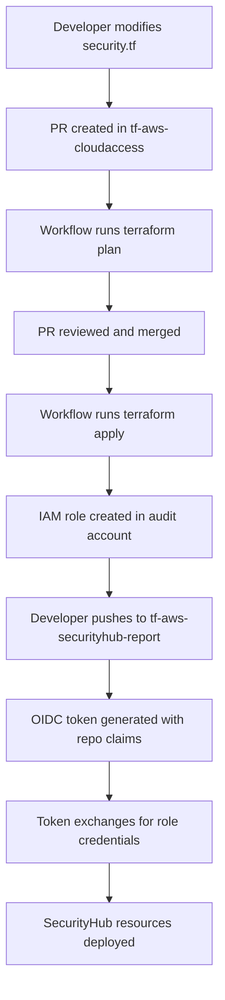

# Real-World Usage: How We Use terraform-aws-oidc at Appvia

This doc explains how we use the `terraform-aws-oidc` module to manage AWS access for all our repos and teams. 

## Overview

We use this module as the foundation for our **GitOps access management strategy** across our entire AWS org. The module gives us secure, passwordless access to AWS resources from GitHub Actions workflows.

## The tf-aws-cloudaccess Repository

Everything starts in the [`tf-aws-cloudaccess`](https://github.com/appvia/tf-aws-cloudaccess) repo (private), which is basically the **central role factory**. This repo creates IAM roles for dozens of different repos and services across the team.

### Key Files Using terraform-aws-oidc

The module is extensively used across multiple files, each managing roles for different purposes:

| File | Purpose | Example Repositories |
|------|---------|---------------------|
| [`security.tf`](https://github.com/appvia/tf-aws-cloudaccess/blob/main/security.tf) | Security and compliance tooling | `tf-aws-securityhub-report` |
| [`finops.tf`](https://github.com/appvia/tf-aws-cloudaccess/blob/main/finops.tf) | Cost management and optimization | `tf-aws-cudos` |
| [`operations.tf`](https://github.com/appvia/tf-aws-cloudaccess/blob/main/operations.tf) | Infrastructure operations | `tf-aws-cicd`, `tf-aws-wayfinder` |
| [`development.tf`](https://github.com/appvia/tf-aws-cloudaccess/blob/main/development.tf) | Development environments | `tf-aws-marketplace` |
| [`production.tf`](https://github.com/appvia/tf-aws-cloudaccess/blob/main/production.tf) | Production workloads | Various production services |
| [`networking.tf`](https://github.com/appvia/tf-aws-cloudaccess/blob/main/networking.tf) | Network infrastructure | Network-related repositories |
| [`landing_zones.tf`](https://github.com/appvia/tf-aws-cloudaccess/blob/main/landing_zones.tf) | AWS Landing Zone setup | Landing zone repositories |
| [`sandboxes.tf`](https://github.com/appvia/tf-aws-cloudaccess/blob/main/sandboxes.tf) | Interview and training environments | Technical test repositories |

## SecurityHub Report Example

Let's trace through a complete example using the **SecurityHub Report** resources to understand how everything connects together.

### Step 1: Instantiating terraform-aws-oidc in tf-aws-cloudaccess

In [`security.tf`](https://github.com/appvia/tf-aws-cloudaccess/blob/main/security.tf), we instantiate the terraform-aws-oidc module for the SecurityHub reporting resources:

```hcl
## SecurityHub Report deployment role
module "oidc_role_audit_securityhub_report" {
  source  = "appvia/oidc/aws//modules/role"
  version = "1.3.10"

  name                = "tf-aws-securityhub-report"
  common_provider     = "github"
  description         = "Export of AWS SecurityHub reports"
  permission_boundary = local.permissive_permission_boundary
  repository          = "appvia/tf-aws-securityhub-report"
  tags                = var.tags

  read_only_policy_arns = [
    "arn:aws:iam::aws:policy/ReadOnlyAccess",
  ]

  read_write_policy_arns = [
    "arn:aws:iam::aws:policy/AdministratorAccess",
  ]

  providers = {
    aws = aws.audit  # Deploy to the audit account
  }
}
```

**Key aspects:**
- **Repository specification**: `"appvia/tf-aws-securityhub-report"` - This creates trust policies that only allow this specific GitHub repository to assume the role
- **Account targeting**: Uses `aws.audit` provider to deploy the role in our audit account
- **Permission structure**: Combines ReadOnlyAccess for general access with AdministratorAccess for deployment capabilities
- **Permission boundary**: Applies our organizational security controls

### Step 2: Role Creation Workflow

When changes are made to `security.tf`, the [`tf-aws-cloudaccess` workflow](https://github.com/appvia/tf-aws-cloudaccess/blob/main/.github/workflows/terraform.yml) triggers:

```yaml
name: Terraform
on:
  push:
    branches: [main]
  pull_request:
    branches: [main]

permissions:
  contents: read
  pull-requests: write
  id-token: write  # Critical: Enables OIDC token creation

jobs:
  terraform:
    uses: appvia/appvia-cicd-workflows/.github/workflows/terraform-plan-and-apply-aws.yml@main
    name: Plan and Apply
    with:
      aws-account-id: 536471746696  # Appvia management account
      aws-read-role-name: lza-github-cloudaccess-ro
      aws-write-role-name: lza-github-cloudaccess-rw
      terraform-state-key: github-tf-aws-cloudaccess.tfstate
```

**What happens during execution:**

1. **OIDC Authentication**: GitHub generates an OIDC token with claims about the repository (`appvia/tf-aws-cloudaccess`)
2. **Role Assumption**: The workflow assumes the `lza-github-cloudaccess-rw` role in the management account
3. **Cross-Account Deployment**: Using the assumed role, Terraform deploys the `tf-aws-securityhub-report` role to the audit account
4. **State Management**: Terraform state is stored in S3 with the key `github-tf-aws-cloudaccess.tfstate`

### Step 3: Target Repository Usage

Once the roles are created (remember, the module creates both read-only and read-write roles), the [`tf-aws-securityhub-report`](https://github.com/appvia/tf-aws-securityhub-report) repository can use them in its [workflow](https://github.com/appvia/tf-aws-securityhub-report/blob/main/.github/workflows/terraform.yml):

```yaml
name: Terraform
on:
  push:
    branches: [main]
  pull_request:
    branches: [main]

permissions:
  contents: read
  pull-requests: write
  id-token: write  # Critical: Enables OIDC token creation

jobs:
  terraform:
    uses: appvia/appvia-cicd-workflows/.github/workflows/terraform-plan-and-apply-aws.yml@main
    name: Plan and Apply        
    with:
      aws-account-id: "012140491173"  # Audit account ID
      # Role name automatically derived from repository name: tf-aws-securityhub-report
```

**What happens during execution:**

1. **OIDC Token Generation**: GitHub creates an OIDC token with claims:
   - `repository`: `"appvia/tf-aws-securityhub-report"`
   - `repository_owner`: `"appvia"`
   - `ref`: `"refs/heads/main"` (for main branch pushes)

2. **Role Assumption**: The shared workflow uses the OIDC token to assume the `tf-aws-securityhub-report` role in the audit account

3. **Resource Management**: The workflow can now deploy and manage SecurityHub reporting infrastructure using the permissions granted to this role

## The Complete Flow: From Role Definition to Resource Deployment



### Trust Policy

The terraform-aws-oidc module creates trust policies that look like this:

```json
{
  "Version": "2012-10-17",
  "Statement": [
    {
      "Effect": "Allow",
      "Principal": {
        "Federated": "arn:aws:iam::012140491173:oidc-provider/token.actions.githubusercontent.com"
      },
      "Action": "sts:AssumeRoleWithWebIdentity",
      "Condition": {
        "StringEquals": {
          "token.actions.githubusercontent.com:aud": "sts.amazonaws.com",
          "token.actions.githubusercontent.com:sub": "repo:appvia/tf-aws-securityhub-report:ref:refs/heads/main"
        }
      }
    }
  ]
}
```

**Security Enforcement:**
- Only the specific repository (`appvia/tf-aws-securityhub-report`) can assume this role
- Only from the main branch (`ref:refs/heads/main`)
- Only when the OIDC audience matches AWS STS


## Production Patterns and Best Practices

Based on our production usage, the following patterns have proven effective:

### 1. **Repository Naming Convention**
Repository names are mapped directly to IAM role names using descriptive naming:
- `tf-aws-securityhub-report` → IAM role: `tf-aws-securityhub-report`
- `tf-aws-cudos` → IAM role: `tf-aws-cudos`

### 2. **Account Segmentation**
Different types of roles are deployed to appropriate accounts:
- **Security tools** → Audit account
- **Cost management** → Management account
- **Development resources** → Development accounts
- **Production workloads** → Production accounts

### 3. **Permission Boundaries**
All roles use permission boundaries for defense-in-depth:
```hcl
permission_boundary = local.permissive_permission_boundary
```

### 4. **Versioning Strategy**
Production deployments use specific module versions:
```hcl
source  = "appvia/oidc/aws//modules/role"
version = "1.3.10"  # Pinned version for stability
```

### 5. **Shared Workflows**
We maintain a [centralized workflow library](https://github.com/appvia/appvia-cicd-workflows) that provides:
- Standardized Terraform execution patterns
- Integrated security scanning and compliance checks
- Consistent error handling and reporting
- Centralized state file management