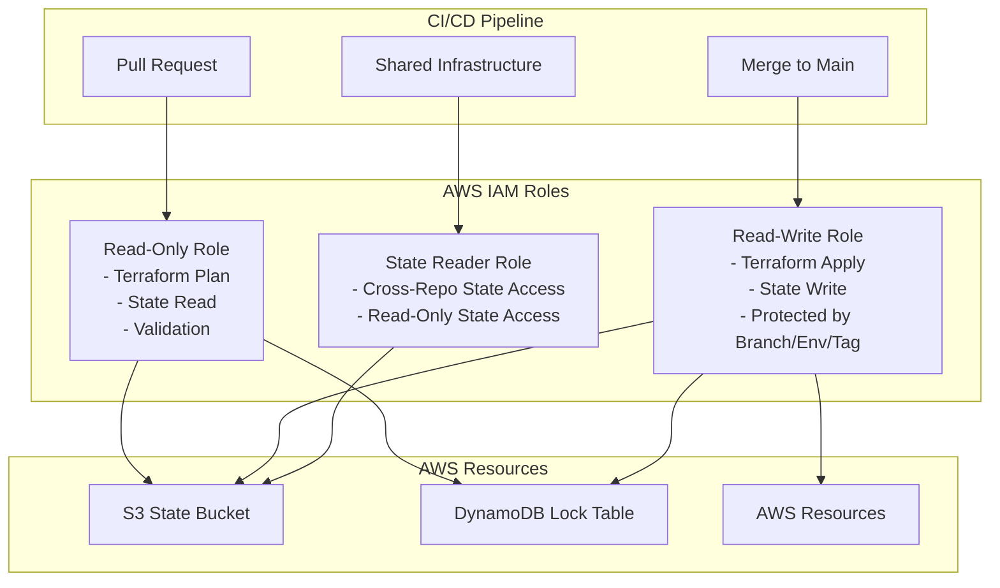
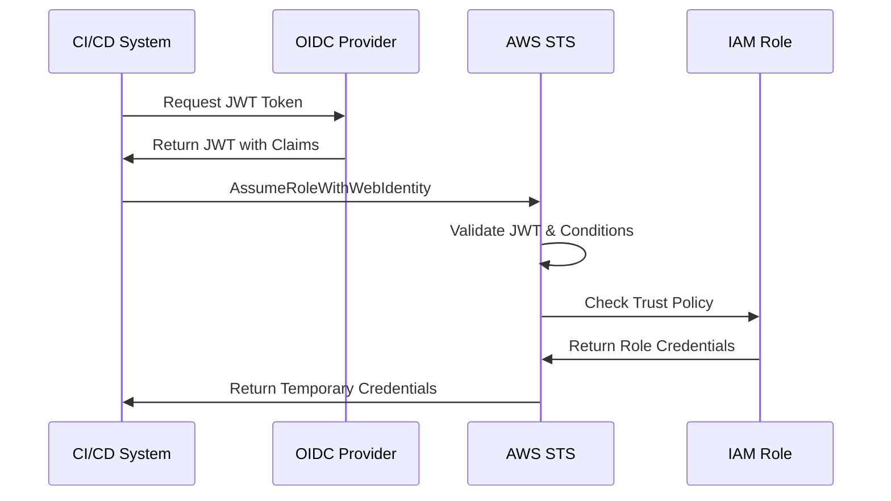

# AWS IAM OIDC Trust Role Module

## Overview

This Terraform module creates a comprehensive set of IAM roles with OpenID Connect (OIDC) trust relationships for secure CI/CD pipeline integration with AWS. The module implements a three-role pattern that provides granular access control for different stages of the CI/CD workflow, ensuring security best practices while enabling automated infrastructure management.

## Purpose & Intent

### **Problem Statement**

Modern CI/CD pipelines require secure access to AWS resources without storing long-term credentials. Traditional approaches using access keys create security risks and operational overhead. Organizations need a solution that:

- Eliminates the need for long-term AWS credentials in CI/CD systems
- Provides granular access control based on repository, branch, environment, and tag context
- Supports multiple source control providers (GitHub, GitLab, Bitbucket)
- Enables secure cross-repository state sharing for complex infrastructure
- Implements least-privilege access with permission boundaries

### **Solution**

This module provides a complete OIDC-based authentication solution that creates three distinct IAM roles:

1. **Read-Only Role**: For Terraform plan operations and validation
2. **Read-Write Role**: For Terraform apply operations with branch/environment/tag protection
3. **State Reader Role**: For cross-repository Terraform state access

## Key Features

### 🔐 **Multi-Provider OIDC Support**

- **GitHub Actions**: Native support with `token.actions.githubusercontent.com`
- **GitLab CI/CD**: Integration with GitLab's OIDC provider
- **Bitbucket Pipelines**: Support for Bitbucket workspace-based OIDC
- **Custom Providers**: Flexible configuration for any OIDC-compliant provider

### 🛡️ **Advanced Security Controls**

- **Permission Boundaries**: Mandatory permission boundary enforcement
- **Conditional Access**: Branch, environment, and tag-based access restrictions
- **Audience Validation**: Strict OIDC audience verification
- **Subject Mapping**: Configurable subject claim mapping for different providers

### 🏗️ **Three-Role Architecture**

- **Read-Only Role**: Safe for pull request validation and planning
- **Read-Write Role**: Protected by branch/environment/tag conditions
- **State Reader Role**: Enables cross-repository state sharing

### 📊 **Terraform State Management**

- **S3 Integration**: Automatic S3 bucket permissions for state storage
- **DynamoDB Locking**: DynamoDB table access for state locking
- **Namespace Support**: Optional entire namespace access for complex deployments
- **Cross-Repository Sharing**: Secure state access across multiple repositories

### ⚙️ **Flexible Configuration**

- **Custom Policies**: Support for both inline and managed policy attachments
- **Session Duration**: Configurable maximum session duration per role
- **Repository UUIDs**: Support for workspace and repository UUID validation
- **State Suffixes**: Flexible state file naming with custom suffixes

### 🔄 **CI/CD Integration**

- **Branch Protection**: Read-write access limited to specific branches
- **Environment Protection**: Environment-specific access controls
- **Tag Protection**: Release and tag-based access restrictions
- **Shared Repositories**: Cross-repository state access for shared infrastructure

## Architecture

### **Three-Role Pattern**



### **OIDC Trust Relationship Flow**



## Supported Source Control Providers

| Provider | OIDC URL | Audience | Subject Mapping |
|----------|----------|----------|-----------------|
| **GitHub** | `https://token.actions.githubusercontent.com` | `sts.amazonaws.com` | `repo:{repo}:*` |
| **GitLab** | `https://gitlab.com` | `https://gitlab.com` | `project_path:{repo}:*` |
| **Bitbucket** | `https://api.bitbucket.org/2.0/workspaces/{workspace}/pipelines-config/identity/oidc` | `ari:cloud:bitbucket::workspace/{uuid}` | `{repo_uuid}:*` |

## Usage

### **Basic Usage - GitHub Actions**

This example demonstrates the basic setup for GitHub Actions with default configuration. It creates three IAM roles with appropriate permissions for Terraform state management and applies a permission boundary for security.

```hcl
module "terraform_roles" {
  source = "appvia/oidc/aws//modules/role"
  
  name        = "terraform-ci-cd"
  description = "IAM roles for Terraform CI/CD pipeline"
  repository  = "my-org/my-terraform-repo"
  
  # Permission boundary for security
  permission_boundary = "TerraformExecutionBoundary"
  
  # Default policies for both roles
  default_managed_policies = [
    "arn:aws:iam::aws:policy/ReadOnlyAccess"
  ]
  
  # Read-write specific policies
  read_write_policy_arns = [
    "arn:aws:iam::aws:policy/PowerUserAccess"
  ]
  
  tags = {
    Environment = "production"
    Project     = "infrastructure"
    Owner       = "platform-team"
  }
}
```

### **Advanced Usage - Multi-Environment with Custom Policies**

This example shows how to configure different access levels for different environments and branches, with custom inline policies and enhanced security controls.

```hcl
module "terraform_roles_advanced" {
  source = "appvia/oidc/aws//modules/role"
  
  name        = "terraform-multi-env"
  description = "Advanced IAM roles for multi-environment Terraform"
  repository  = "my-org/infrastructure"
  
  # Enhanced protection controls
  protected_by = {
    branch      = "main"
    environment = "production"
    tag         = "v*"
  }
  
  # Custom permission boundary
  permission_boundary_arn = "arn:aws:iam::123456789012:policy/CustomTerraformBoundary"
  
  # Custom inline policies for read-only role
  read_only_inline_policies = {
    "S3SpecificAccess" = jsonencode({
      Version = "2012-10-17"
      Statement = [
        {
          Effect = "Allow"
          Action = [
            "s3:GetObject",
            "s3:ListBucket"
          ]
          Resource = [
            "arn:aws:s3:::my-specific-bucket",
            "arn:aws:s3:::my-specific-bucket/*"
          ]
        }
      ]
    })
  }
  
  # Custom inline policies for read-write role
  read_write_inline_policies = {
    "EC2Management" = jsonencode({
      Version = "2012-10-17"
      Statement = [
        {
          Effect = "Allow"
          Action = [
            "ec2:*",
            "ec2-instance-connect:*"
          ]
          Resource = "*"
        }
      ]
    })
  }
  
  # Session duration limits
  read_only_max_session_duration  = 3600  # 1 hour
  read_write_max_session_duration = 7200  # 2 hours
  
  # State management configuration
  tf_state_suffix = "prod"
  enable_entire_namespace = true
  
  tags = {
    Environment = "production"
    Project     = "infrastructure"
    Owner       = "platform-team"
    Compliance  = "required"
  }
}
```

### **Cross-Repository State Sharing**

This example demonstrates how to enable cross-repository state sharing for shared infrastructure components.

```hcl
module "shared_infrastructure_roles" {
  source = "appvia/oidc/aws//modules/role"
  
  name        = "shared-infrastructure"
  description = "Roles for shared infrastructure state access"
  repository  = "my-org/shared-infrastructure"
  
  # Enable cross-repository state sharing
  shared_repositories = [
    "my-org/app1",
    "my-org/app2",
    "my-org/app3"
  ]
  
  # State reader role gets read access to shared state
  read_only_policy_arns = [
    "arn:aws:iam::aws:policy/ReadOnlyAccess"
  ]
  
  tags = {
    Environment = "shared"
    Project     = "infrastructure"
    Owner       = "platform-team"
  }
}
```

### **Custom OIDC Provider Configuration**

This example shows how to configure a custom OIDC provider for non-standard CI/CD systems.

```hcl
module "custom_oidc_roles" {
  source = "appvia/oidc/aws//modules/role"
  
  name        = "custom-ci-cd"
  description = "Roles for custom CI/CD system"
  repository  = "my-org/custom-pipeline"
  
  # Custom OIDC provider configuration
  custom_provider = {
    url       = "https://my-custom-oidc-provider.com"
    audiences = ["my-custom-audience"]
    
    subject_reader_mapping = "repo:{repo}:*"
    subject_branch_mapping = "repo:{repo}:ref:refs/heads/{ref}"
    subject_env_mapping    = "repo:{repo}:environment:{env}"
    subject_tag_mapping    = "repo:{repo}:ref:refs/tags/{ref}"
  }
  
  # Additional audiences
  additional_audiences = [
    "sts.amazonaws.com",
    "my-backup-audience"
  ]
  
  tags = {
    Environment = "production"
    Project     = "custom-pipeline"
    Owner       = "platform-team"
  }
}
```

### **Bitbucket Pipelines Configuration**

This example demonstrates configuration for Bitbucket Pipelines with workspace and repository UUIDs.

```hcl
module "bitbucket_roles" {
  source = "appvia/oidc/aws//modules/role"
  
  name        = "bitbucket-terraform"
  description = "IAM roles for Bitbucket Pipelines"
  repository  = "my-workspace/my-terraform-repo"
  
  # Bitbucket-specific configuration
  common_provider = "bitbucket"
  workspace_name  = "my-workspace"
  workspace_uuid  = "8a1f1c70-cbc0-452c-81ce-07534945e18b"
  repository_uuid = "12345678-1234-1234-1234-123456789abc"
  
  # Protection controls
  protected_by = {
    branch = "main"
    tag    = "release-*"
  }
  
  tags = {
    Environment = "production"
    Project     = "infrastructure"
    Owner       = "platform-team"
  }
}
```

## Use Cases

### **1. Standard CI/CD Pipeline**

**Scenario**: A typical CI/CD pipeline with pull request validation and main branch deployment.

**Configuration**:

- Read-only role for PR validation and planning
- Read-write role protected by main branch
- Standard GitHub Actions integration

**Benefits**:

- Secure credential-free authentication
- Automatic branch-based access control
- Standard Terraform state management

### **2. Multi-Environment Deployment**

**Scenario**: Complex infrastructure with multiple environments (dev, staging, production).

**Configuration**:

- Environment-specific protection controls
- Custom policies per environment
- Cross-repository state sharing

**Benefits**:

- Environment isolation
- Flexible access controls
- Shared infrastructure components

### **3. Shared Infrastructure Management**

**Scenario**: Multiple applications sharing common infrastructure components.

**Configuration**:

- State reader role for cross-repository access
- Shared repository configuration
- Namespace-based state access

**Benefits**:

- Centralized infrastructure management
- Secure cross-repository access
- Reduced duplication

### **4. Compliance-Focused Deployment**

**Scenario**: Organizations with strict compliance requirements and audit trails.

**Configuration**:

- Mandatory permission boundaries
- Custom session duration limits
- Enhanced tagging and monitoring

**Benefits**:

- Compliance with security standards
- Audit trail capabilities
- Risk mitigation

## Security & Compliance

### **OIDC Trust Relationships**

The module implements secure OIDC trust relationships with the following security features:

- **JWT Validation**: Strict validation of JWT tokens from OIDC providers
- **Audience Verification**: Ensures tokens are intended for AWS
- **Subject Claim Validation**: Validates repository, branch, environment, and tag claims
- **Conditional Access**: Branch, environment, and tag-based access restrictions

### **Permission Boundaries**

All roles support permission boundaries to prevent privilege escalation:

```hcl
# Example permission boundary policy
{
  "Version": "2012-10-17",
  "Statement": [
    {
      "Effect": "Allow",
      "Action": "*",
      "Resource": "*",
      "Condition": {
        "StringNotEquals": {
          "aws:RequestedRegion": ["us-east-1"]
        }
      }
    }
  ]
}
```

### **Least Privilege Access**

The module implements least privilege principles:

- **Read-Only Role**: Only S3 read and DynamoDB read permissions
- **Read-Write Role**: S3 read/write and DynamoDB read/write permissions
- **State Reader Role**: Cross-repository read-only state access

### **Audit and Monitoring**

Built-in audit capabilities:

- **CloudTrail Integration**: All role assumptions are logged
- **Resource Tagging**: Comprehensive tagging for cost and compliance tracking
- **Session Duration Limits**: Configurable maximum session durations

## IAM Permissions

### **Read-Only Role Permissions**

The read-only role includes the following permissions:

- **S3 State Access**: `s3:GetObject`, `s3:ListBucket` for Terraform state files
- **DynamoDB Locking**: `dynamodb:GetItem`, `dynamodb:DescribeTable` for state locking
- **Custom Policies**: Additional read-only policies as configured

### **Read-Write Role Permissions**

The read-write role includes the following permissions:

- **S3 State Management**: Full S3 access for state file management
- **DynamoDB Locking**: Full DynamoDB access for state locking
- **Custom Policies**: Additional read-write policies as configured

### **State Reader Role Permissions**

The state reader role includes the following permissions:

- **Cross-Repository State Access**: Read-only access to shared state files
- **S3 State Access**: `s3:GetObject`, `s3:ListBucket` for shared state files

## Update Documentation

The `terraform-docs` utility is used to generate this README. Follow the below steps to update:

1. Make changes to the `.terraform-docs.yml` file
2. Fetch the `terraform-docs` binary (<https://terraform-docs.io/user-guide/installation/>)
3. Run `terraform-docs markdown table --output-file ${PWD}/README.md --output-mode inject .`

## Requirements

| Name                                                                     | Version |
| ------------------------------------------------------------------------ | ------- |
| <a name="requirement_terraform"></a> [terraform](#requirement_terraform) | >= 1.0  |

## Providers

| Name                                             | Version |
| ------------------------------------------------ | ------- |
| <a name="provider_aws"></a> [aws](#provider_aws) | n/a     |

## Modules

No modules.

## Resources

| Name                                                                                                                                                    | Type        |
| ------------------------------------------------------------------------------------------------------------------------------------------------------- | ----------- |
| [aws_iam_policy.tfstate_apply](https://registry.terraform.io/providers/hashicorp/aws/latest/docs/resources/iam_policy)                                  | resource    |
| [aws_iam_policy.tfstate_plan](https://registry.terraform.io/providers/hashicorp/aws/latest/docs/resources/iam_policy)                                   | resource    |
| [aws_iam_policy.tfstate_remote](https://registry.terraform.io/providers/hashicorp/aws/latest/docs/resources/iam_policy)                                 | resource    |
| [aws_iam_role.ro](https://registry.terraform.io/providers/hashicorp/aws/latest/docs/resources/iam_role)                                                 | resource    |
| [aws_iam_role.rw](https://registry.terraform.io/providers/hashicorp/aws/latest/docs/resources/iam_role)                                                 | resource    |
| [aws_iam_role.sr](https://registry.terraform.io/providers/hashicorp/aws/latest/docs/resources/iam_role)                                                 | resource    |
| [aws_iam_role_policy_attachment.ro](https://registry.terraform.io/providers/hashicorp/aws/latest/docs/resources/iam_role_policy_attachment)             | resource    |
| [aws_iam_role_policy_attachment.rw](https://registry.terraform.io/providers/hashicorp/aws/latest/docs/resources/iam_role_policy_attachment)             | resource    |
| [aws_iam_role_policy_attachment.tfstate_apply](https://registry.terraform.io/providers/hashicorp/aws/latest/docs/resources/iam_role_policy_attachment)  | resource    |
| [aws_iam_role_policy_attachment.tfstate_plan](https://registry.terraform.io/providers/hashicorp/aws/latest/docs/resources/iam_role_policy_attachment)   | resource    |
| [aws_iam_role_policy_attachment.tfstate_remote](https://registry.terraform.io/providers/hashicorp/aws/latest/docs/resources/iam_role_policy_attachment) | resource    |
| [aws_caller_identity.current](https://registry.terraform.io/providers/hashicorp/aws/latest/docs/data-sources/caller_identity)                           | data source |
| [aws_iam_openid_connect_provider.this](https://registry.terraform.io/providers/hashicorp/aws/latest/docs/data-sources/iam_openid_connect_provider)      | data source |
| [aws_iam_policy_document.base](https://registry.terraform.io/providers/hashicorp/aws/latest/docs/data-sources/iam_policy_document)                      | data source |
| [aws_iam_policy_document.dynamo](https://registry.terraform.io/providers/hashicorp/aws/latest/docs/data-sources/iam_policy_document)                    | data source |
| [aws_iam_policy_document.ro](https://registry.terraform.io/providers/hashicorp/aws/latest/docs/data-sources/iam_policy_document)                        | data source |
| [aws_iam_policy_document.rw](https://registry.terraform.io/providers/hashicorp/aws/latest/docs/data-sources/iam_policy_document)                        | data source |
| [aws_iam_policy_document.sr](https://registry.terraform.io/providers/hashicorp/aws/latest/docs/data-sources/iam_policy_document)                        | data source |
| [aws_iam_policy_document.tfstate_apply](https://registry.terraform.io/providers/hashicorp/aws/latest/docs/data-sources/iam_policy_document)             | data source |
| [aws_iam_policy_document.tfstate_plan](https://registry.terraform.io/providers/hashicorp/aws/latest/docs/data-sources/iam_policy_document)              | data source |
| [aws_iam_policy_document.tfstate_remote](https://registry.terraform.io/providers/hashicorp/aws/latest/docs/data-sources/iam_policy_document)            | data source |
| [aws_region.current](https://registry.terraform.io/providers/hashicorp/aws/latest/docs/data-sources/region)                                             | data source |

## Inputs

| Name                                                                                                                           | Description                                                                           | Type                                                                                                                                                                              | Default  | Required |
| ------------------------------------------------------------------------------------------------------------------------------ | ------------------------------------------------------------------------------------- | --------------------------------------------------------------------------------------------------------------------------------------------------------------------------------- | -------- | :------: |
| <a name="input_additional_audiences"></a> [additional_audiences](#input_additional_audiences)                                  | Additional audiences to be allowed in the OIDC federation mapping                     | `list(string)`                                                                                                                                                                    | `[]`     |    no    |
| <a name="input_common_provider"></a> [common_provider](#input_common_provider)                                                 | The name of a common OIDC provider to be used as the trust for the role               | `string`                                                                                                                                                                          | `""`     |    no    |
| <a name="input_custom_provider"></a> [custom_provider](#input_custom_provider)                                                 | An object representing an `aws_iam_openid_connect_provider` resource                  | <pre>object({<br> url = string<br> audiences = list(string)<br> subject_reader_mapping = string<br> subject_branch_mapping = string<br> subject_tag_mapping = string<br> })</pre> | `null`   |    no    |
| <a name="input_description"></a> [description](#input_description)                                                             | Description of the role being created                                                 | `string`                                                                                                                                                                          | n/a      |   yes    |
| <a name="input_force_detach_policies"></a> [force_detach_policies](#input_force_detach_policies)                               | Flag to force detachment of policies attached to the IAM role.                        | `bool`                                                                                                                                                                            | `null`   |    no    |
| <a name="input_name"></a> [name](#input_name)                                                                                  | Name of the role to create                                                            | `string`                                                                                                                                                                          | n/a      |   yes    |
| <a name="input_permission_boundary_arn"></a> [permission_boundary_arn](#input_permission_boundary_arn)                         | The ARN of the policy that is used to set the permissions boundary for the IAM role   | `string`                                                                                                                                                                          | `null`   |    no    |
| <a name="input_protected_branch"></a> [protected_branch](#input_protected_branch)                                              | The name of the protected branch under which the read-write role can be assumed       | `string`                                                                                                                                                                          | `"main"` |    no    |
| <a name="input_protected_tag"></a> [protected_tag](#input_protected_tag)                                                       | The name of the protected tag under which the read-write role can be assume           | `string`                                                                                                                                                                          | `"*"`    |    no    |
| <a name="input_read_only_inline_policies"></a> [read_only_inline_policies](#input_read_only_inline_policies)                   | Inline policies map with policy name as key and json as value.                        | `map(string)`                                                                                                                                                                     | `{}`     |    no    |
| <a name="input_read_only_max_session_duration"></a> [read_only_max_session_duration](#input_read_only_max_session_duration)    | The maximum session duration (in seconds) that you want to set for the specified role | `number`                                                                                                                                                                          | `null`   |    no    |
| <a name="input_read_only_policy_arns"></a> [read_only_policy_arns](#input_read_only_policy_arns)                               | List of IAM policy ARNs to attach to the read-only role                               | `list(string)`                                                                                                                                                                    | `[]`     |    no    |
| <a name="input_read_write_inline_policies"></a> [read_write_inline_policies](#input_read_write_inline_policies)                | Inline policies map with policy name as key and json as value.                        | `map(string)`                                                                                                                                                                     | `{}`     |    no    |
| <a name="input_read_write_max_session_duration"></a> [read_write_max_session_duration](#input_read_write_max_session_duration) | The maximum session duration (in seconds) that you want to set for the specified role | `number`                                                                                                                                                                          | `null`   |    no    |
| <a name="input_read_write_policy_arns"></a> [read_write_policy_arns](#input_read_write_policy_arns)                            | List of IAM policy ARNs to attach to the read-write role                              | `list(string)`                                                                                                                                                                    | `[]`     |    no    |
| <a name="input_repository"></a> [repository](#input_repository)                                                                | List of repositories to be allowed i nthe OIDC federation mapping                     | `string`                                                                                                                                                                          | n/a      |   yes    |
| <a name="input_role_path"></a> [role_path](#input_role_path)                                                                   | Path under which to create IAM role.                                                  | `string`                                                                                                                                                                          | `null`   |    no    |
| <a name="input_shared_repositories"></a> [shared_repositories](#input_shared_repositories)                                     | List of repositories to provide read access to the remote state                       | `list(string)`                                                                                                                                                                    | `[]`     |    no    |
| <a name="input_tags"></a> [tags](#input_tags)                                                                                  | Tags to apply resoures created by this module                                         | `map(string)`                                                                                                                                                                     | `{}`     |    no    |

## Outputs

| Name                                                                    | Description |
| ----------------------------------------------------------------------- | ----------- |
| <a name="output_read_only"></a> [read_only](#output_read_only)          | n/a         |
| <a name="output_read_write"></a> [read_write](#output_read_write)       | n/a         |
| <a name="output_state_reader"></a> [state_reader](#output_state_reader) | n/a         |

<!-- BEGIN_TF_DOCS -->
## Providers

| Name | Version |
|------|---------|
| <a name="provider_aws"></a> [aws](#provider\_aws) | n/a |

## Inputs

| Name | Description | Type | Default | Required |
|------|-------------|------|---------|:--------:|
| <a name="input_description"></a> [description](#input\_description) | Description of the role being created | `string` | n/a | yes |
| <a name="input_name"></a> [name](#input\_name) | Name of the role to create | `string` | n/a | yes |
| <a name="input_repository"></a> [repository](#input\_repository) | Repository to be allowed in the OIDC federation mapping | `string` | n/a | yes |
| <a name="input_tags"></a> [tags](#input\_tags) | Tags to apply resoures created by this module | `map(string)` | n/a | yes |
| <a name="input_account_id"></a> [account\_id](#input\_account\_id) | The AWS account ID to create the role in | `string` | `null` | no |
| <a name="input_additional_audiences"></a> [additional\_audiences](#input\_additional\_audiences) | Additional audiences to be allowed in the OIDC federation mapping | `list(string)` | `[]` | no |
| <a name="input_common_provider"></a> [common\_provider](#input\_common\_provider) | The name of a common OIDC provider to be used as the trust for the role | `string` | `"github"` | no |
| <a name="input_custom_provider"></a> [custom\_provider](#input\_custom\_provider) | An object representing an `aws_iam_openid_connect_provider` resource | <pre>object({<br/>    url                    = string<br/>    audiences              = list(string)<br/>    subject_reader_mapping = string<br/>    subject_branch_mapping = string<br/>    subject_env_mapping    = string<br/>    subject_tag_mapping    = string<br/>  })</pre> | `null` | no |
| <a name="input_default_inline_policies"></a> [default\_inline\_policies](#input\_default\_inline\_policies) | Inline policies map with policy name as key and json as value, attached to both read-only and read-write roles | `map(string)` | `{}` | no |
| <a name="input_default_managed_policies"></a> [default\_managed\_policies](#input\_default\_managed\_policies) | List of IAM managed policy ARNs to attach to this role/s, both read-only and read-write | `list(string)` | `[]` | no |
| <a name="input_enable_entire_namespace"></a> [enable\_entire\_namespace](#input\_enable\_entire\_namespace) | Amended the S3 permissions to write to entire key space i.e <REPOSITORY\_NAME>/* | `bool` | `false` | no |
| <a name="input_force_detach_policies"></a> [force\_detach\_policies](#input\_force\_detach\_policies) | Flag to force detachment of policies attached to the IAM role. | `bool` | `null` | no |
| <a name="input_permission_boundary"></a> [permission\_boundary](#input\_permission\_boundary) | The name of the policy that is used to set the permissions boundary for the IAM role | `string` | `null` | no |
| <a name="input_permission_boundary_arn"></a> [permission\_boundary\_arn](#input\_permission\_boundary\_arn) | The full ARN of the permission boundary to attach to the role | `string` | `null` | no |
| <a name="input_protected_by"></a> [protected\_by](#input\_protected\_by) | The branch, environment and/or tag to protect the role against | <pre>object({<br/>    branch      = optional(string)<br/>    environment = optional(string)<br/>    tag         = optional(string)<br/>  })</pre> | <pre>{<br/>  "branch": "main",<br/>  "environment": "production",<br/>  "tag": "*"<br/>}</pre> | no |
| <a name="input_read_only_inline_policies"></a> [read\_only\_inline\_policies](#input\_read\_only\_inline\_policies) | Inline policies map with policy name as key and json as value. | `map(string)` | `{}` | no |
| <a name="input_read_only_max_session_duration"></a> [read\_only\_max\_session\_duration](#input\_read\_only\_max\_session\_duration) | The maximum session duration (in seconds) that you want to set for the specified role | `number` | `null` | no |
| <a name="input_read_only_policy_arns"></a> [read\_only\_policy\_arns](#input\_read\_only\_policy\_arns) | List of IAM policy ARNs to attach to the read-only role | `list(string)` | `[]` | no |
| <a name="input_read_write_inline_policies"></a> [read\_write\_inline\_policies](#input\_read\_write\_inline\_policies) | Inline policies map with policy name as key and json as value. | `map(string)` | `{}` | no |
| <a name="input_read_write_max_session_duration"></a> [read\_write\_max\_session\_duration](#input\_read\_write\_max\_session\_duration) | The maximum session duration (in seconds) that you want to set for the specified role | `number` | `null` | no |
| <a name="input_read_write_policy_arns"></a> [read\_write\_policy\_arns](#input\_read\_write\_policy\_arns) | List of IAM policy ARNs to attach to the read-write role | `list(string)` | `[]` | no |
| <a name="input_region"></a> [region](#input\_region) | The region in which the role will be used (defaulting to the provider region) | `string` | `null` | no |
| <a name="input_repository_uuid"></a> [repository\_uuid](#input\_repository\_uuid) | Repository UUID. You can get it in the repository settings in the OpenID connect provider. | `string` | `null` | no |
| <a name="input_role_path"></a> [role\_path](#input\_role\_path) | Path under which to create IAM role. | `string` | `null` | no |
| <a name="input_shared_repositories"></a> [shared\_repositories](#input\_shared\_repositories) | List of repositories to provide read access to the remote state | `list(string)` | `[]` | no |
| <a name="input_tf_state_suffix"></a> [tf\_state\_suffix](#input\_tf\_state\_suffix) | A suffix for the terraform statefile, e.g. <repo>-<tf\_state\_suffix>.tfstate | `string` | `""` | no |
| <a name="input_workspace_name"></a> [workspace\_name](#input\_workspace\_name) | The name of the workspace. | `string` | `null` | no |
| <a name="input_workspace_uuid"></a> [workspace\_uuid](#input\_workspace\_uuid) | Workspace UUID. You can get it in the repository settings in the OpenID connect provider. Don't include the brackets and make sure it is lower cased. | `string` | `null` | no |

## Outputs

| Name | Description |
|------|-------------|
| <a name="output_read_only"></a> [read\_only](#output\_read\_only) | The ARN of the IAM read-only role |
| <a name="output_read_write"></a> [read\_write](#output\_read\_write) | The ARN of the IAM read-write role |
| <a name="output_state_reader"></a> [state\_reader](#output\_state\_reader) | The ARN of the IAM state reader role |
<!-- END_TF_DOCS -->
